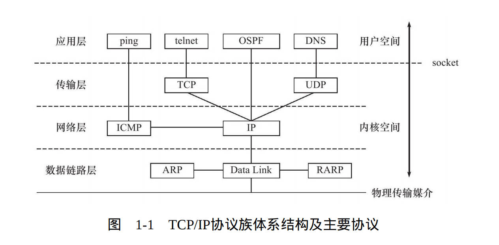
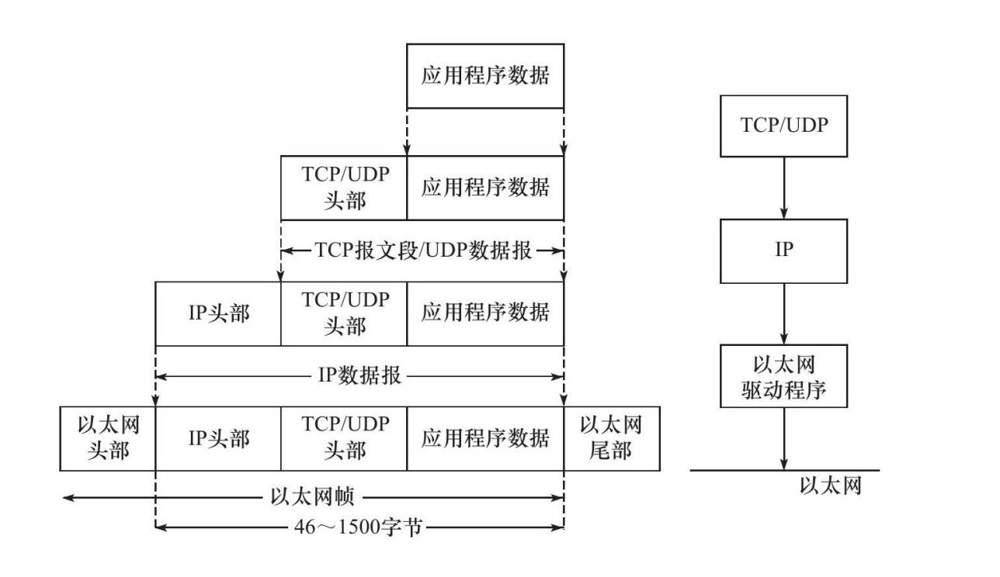

# 网络开发基本概念

## 1. 网络编程的基本概念

通俗来说：

网络开发本质是两台或者多台的计算机之间通信，通信首先要确保机器之间的物理层面上的连接，然后通过网络协议，确保数据的传输，最后通过应用层的协议，确保数据的正确性和完整性，到这个地方就是**分层模型的概念**，不同的层面解决不同的问题。在确保连接成功后，A机器给B机器发送数据，这个时候需要确保发送过去的数据可以被机器畸解析，这个就是**协议的概念**，协议就是一组规则，用来解释数据。每一层都有不同的协议。我们需要重点关注学习的就是TCP/IP协议族，他包含了多个层次和多种协议。但是我们不能直接编写程序，直接的使用硬件，直接的使用协议来传输数据，我们开发实际上是调用系统封装好的接口，来传输数据，这个接口就是**套接字**，套接字是网络编程的基础，属于系统调用的层次，我们在开发的时候，主要是调用套接字的API来实现网络编程。

## 2. 网络开发 分层模型

计算机网络中的所有问题都可以通过增加一个间接层来解决

“层”的概念是指计算机网络中的分层模型，也就是将网络通信过程划分为多个功能不同的层次。每一层都承担特定的功能，并为其上一层提供服务。这样的分层设计使网络通信的实现更加模块化、清晰化，便于理解和维护。

```SHELL
# OSI七层模型 vs TCP/IP四层模型

| OSI七层模型 | TCP/IP四层模型 | 功能描述                                                                   | 常见协议                         |
|-------------|----------------|--------------------------------------------------------------------------|----------------------------------|
| 应用层      | 应用层         | 为应用程序提供网络服务接口，如HTTP、FTP、SMTP等。                            | HTTP, FTP, SMTP, DNS, Telnet     |
| 表示层      |                | 数据格式转换、加密解密、数据压缩等。                                        | SSL, TLS, JPEG, MPEG             |
| 会话层      |                | 管理会话，建立、维护和终止会话连接。                                        | NetBIOS, PPTP                    |
| 传输层      | 传输层         | 提供端到端的通信，确保数据可靠传输，如TCP、UDP。                             | TCP, UDP                         |
| 网络层      | 网络层         | 负责数据包的路由和转发，如IP协议。                                          | IP, ICMP, ARP, RARP              |
| 数据链路层  | 网络接口层     | 负责数据帧的传输，提供物理地址（MAC地址），如以太网协议。                     | Ethernet, PPP, Switch, Bridge    |
| 物理层      |                | 负责比特流的传输，定义物理设备的标准，如电缆、光纤、无线电波等。              | IEEE 802.3, IEEE 802.11, RS-232  |
```


## 3. 协议：
1. 协议的定义：在计算机网络中，协议（Protocol）是指一组规则和约定，用于定义网络设备之间如何进行通信和数据交换。协议规定了数据格式、传输方式、错误检测和纠正方法等内容，以确保不同设备之间能够正确理解和处理传输的数据。简单来讲就是一组规则，用来解释数据
2. 协议也应用于系统的各个部分，包括：硬件通信协议，应用层协议，安全协议等，我们这里只需要学习网络层面的协议就可以
3. 常见的网络协议：
    + 应用层协议：
        HTTP/HTTPS：用于Web浏览的超文本传输协议。
        FTP：用于文件传输的文件传输协议。
        SMTP/POP3/IMAP：用于电子邮件传输和接收的协议。

    + 传输层协议：
        TCP：传输控制协议，提供可靠的、面向连接的通信。
        UDP：用户数据报协议，提供无连接的、不可靠的通信。

    + 网络层协议：
        IP：互联网协议，负责数据包的路由和传输。
        ICMP：互联网控制消息协议，用于网络诊断和错误报告。
    + 数据链路层协议：
        Ethernet：以太网协议，定义了局域网中的数据帧格式和传输方式。
        PPP：点对点协议，用于点对点连接的数据链路层协议。

4. 我们在开发的时候，实际不与协议进行直接交互，在C语言中，进行网络编程通常使用套接字API（如socket()、bind()、listen()、accept()、connect()等）。这些API实际上是对操作系统底层系统调用的封装。作系统的网络协议栈：操作系统实现了网络协议栈（如TCP/IP协议栈）。当应用程序通过套接字API进行网络操作时，实际的协议处理（如连接建立、数据传输、错误检测等）是由操作系统完成的。

### 4. TCP/IP 协议

1. 我们在学习unix网络开发的时候，主要学习的就是TCP/IP 协议族
2. TCP/IP协议允许计算机，智能手机和嵌入式设备之间通信，他们可以采用各种尺寸，来自不同供应商的硬件和软件
3. TCP/IP协议族是一个分层的协议族，包括四个层次：数据链路层、网络层、传输层和应用层。每个层次都有自己的协议，用于解决不同的问题。TCP/IP协议族是互联网的基础，为互联网的通信提供了可靠的基础。**作为开发人员：只关心应用层的逻辑和实现，传输层的以下的细节，通常是系统决定的**



TCP/IP 协议族包括四个层次：

1. 数据链路层：实现了网卡接口的网络驱动程序，以处理数据在物理媒介上的传输。不同的物理网络具有不同的电气特性，网络驱动程序隐藏了这些细节，为上层的网络层提供了统一的接口。
    数据链路层两个常用的协议：ARP（地址解析协议）和RARP（逆地址解析协议）。
2. 网络层：网络层是西安数据包的选路和转发。WAN（广域网）和LAN（局域网）之间的数据包传输，都是通过网络层的路由器来实现的。网络层的两个重要协议是IP（互联网协议）和ICMP（互联网控制消息协议）。
    网络层的两个重要协议是IP（互联网协议）和ICMP（互联网控制消息协议）。
3. 传输层：传输层为两台主机上的应用程序提供端到端的通信，传输层只关心通信的起始端和目的端，而不关心中间的网络结构。
    传输层的三个重要协议是TCP（传输控制协议）和UDP（用户数据报协议），以及SCIP（流控制传输协议）。
    TCP协议（Transmission Control Protocol 传输控制协议）是一种面向连接的、可靠的、基于字节流的传输层协议。TCP协议提供了数据的可靠传输，保证数据的顺序性，以及拥塞控制等功能。
    UDP协议（User Datagram Protocol 用户数据报协议）是一种无连接的、不可靠的传输层协议。UDP协议不保证数据的可靠传输，也不保证数据的顺序性，但是传输效率高。
    SCTP协议（Stream Control Transmission Protocol 流控制传输协议）是一种面向消息的传输层协议，提供了数据的可靠传输、顺序传输、拥塞控制等功能。
4. 应用层：应用层负责处理应用程序的逻辑。数据链路层，网络层和传输层的协议都是为应用层提供服务的。应用层的协议有很多，如HTTP、FTP、SMTP、POP3、IMAP等。

### 5. 封装



1. 我们知道网络是分层次的，不同的层次解决的是不同的问题，那么在网络通信的过程中，数据是如何在不同的层次之间传递的呢？
2. 数据在网络中的传输过程，是通过封装的方式实现的。封装是指将数据包装成不同的协议格式，以适应不同的网络层次。
3. 我们讲原始的应用程序的数据封装，经过应用层、传输层、网络层、数据链路层，最终封装成物理层的数据帧，然后通过物理层的网络设备传输到目的主机，再经过解封装的过程，将数据还原为原始的应用程序数据。
4. TCP/UDP报文：应用程序的原始数据，首先被封装成TCP或UDP报文，然后传输到网络层。
5. IP数据报：TCP/UDP报文被封装成IP数据报，然后传输到数据链路层。
6. 以太网帧：IP数据报被封装成以太网帧，然后通过物理层的网络设备传输到目的主机。
7. 帧才是最终在物理层面上传输的字节序列
8. 分用：数据在网络中的传输过程，是通过封装的方式实现的。封装是指将数据包装成不同的协议格式，以适应不同的网络层次。
9. 解封装：目的主机接收到以太网帧，然后逐层解封装，最终还原为原始的应用程序数据。

### 6. DNS 域名系统

1. DNS（Domain Name System 域名系统）是互联网的一项服务，它作为将域名和IP地址相互映射的一个分布式数据库，能够使人更方便地访问互联网。
2. DNS的作用：DNS是一个分布式数据库，用于域名和IP地址之间的映射。在互联网上，每个主机都有一个唯一的IP地址，但是IP地址不方便记忆，而域名则更容易记忆。DNS服务就是为了解决这个问题，它提供了域名到IP地址的映射服务，使用户可以通过域名访问互联网。
3. linux上查看DNS：cat /etc/resolv.conf

### 7. socket 套接字

1. 前面提到 数据链路层，网络层，传输层协议的在内核中实现的。因此操作系统需要实现一组系统调用，使得应用程序能够访问这些协议提供的服务
2. 实现这组系统调用的是API（应用程序编程接口）主要有两套 socket和XTI，XTI现在基本不使用，我们主要使用socket
3. socket定义的这一组API提供两点功能：
    + 将应用程序数据从用户缓冲区中复制到TCP/UDP内核发送缓冲区，以交付内核来发送数据，或者是从内核TCP/UDP接收缓冲区复制数据到用户缓冲区，以读取数据
    + 应用程序可以通过他们来修改内核中各层协议的某些头部信息或者其他数据结构，从而精确的控制底层通信行为

## 8. IP 协议

ip地址：是用于标识网络中设备的唯一地址。IP地址在网络通信中起着至关重要的作用，它使得数据包能够正确地从源设备传输到目标设备
1. IP 分为两个版本：IPv4 和 IPv6
2. 在Linux下使用ifconfig命令查看网络接口信息
3. IP地址的分类：A类地址、B类地址、C类地址、D类地址、E类地址
4. IP协议位于网络层，负责数据包的路由和传输
5. IP协议分为两个部分：IP头部和IP数据部分
    + IP头部信息：IP头部包含了数据包的源地址和目的地址，以及其他一些控制信息
    + IP数据部分：IP数据部分包含了传输的数据
6. IP协议的特点：IP协议是TCP/IP协议族的动力，为上层协议提供了无状态，无连接，不可靠的服务
    无状态：每个数据包独立处理，不记录状态。
    无连接：无需建立连接，数据包独立传输。
    不可靠：不保证数据包的传输成功和顺序。
7. 使用ping命令测试网络连通性

## 9. TCP 协议
1. TCP 协议是TCP/IP协议族中的一个重要协议，位于传输层，负责提供可靠的、面向连接的通信
2. TCP 服务的特点：传输层协议主要有两个，TCP 协议和 UDP 协议，TCP协议相对于UDP协议的特点：面向连接，字节流和可靠传输
    使用TCP协议通信的双方必须先建立了连接，然后才能开始数据的读取和写入，双方都必须为该连接分配必要的内核资源，以管理连接的状态和连接上数据的传输,TCP是全双工的，即双方的数据读写可以通过一个连接进行。完成数据交换以后，通信双方都必须断开连接以释放系统资源
    TCP协议的连接是一对一的连接
3. TCP 协议的数据段分为头部和数据两部分
    + TCP头部：TCP头部包含了数据段的源端口和目的端口，以及其他一些控制信息
    + TCP数据：TCP数据部分包含了传输的数据

#### TCP 协议连接的过程

1. TCP连接的建立（三次握手）
三次握手（Three-Way Handshake）是TCP协议用于建立连接的过程，确保双方都准备好进行通信，并且能够同步初始序列号。具体步骤如下：

第一次握手（SYN）

客户端：发送一个SYN（同步序列号）报文，包含一个初始序列号seq = x，表示请求建立连接。
服务器：接收到SYN报文，进入SYN_RECEIVED状态。
第二次握手（SYN-ACK）

服务器：发送一个SYN-ACK（同步序列号确认）报文，包含服务器的初始序列号seq = y和对客户端序列号的确认ack = x + 1。
客户端：接收到SYN-ACK报文，进入ESTABLISHED状态。
第三次握手（ACK）

客户端：发送一个ACK（确认）报文，包含对服务器序列号的确认ack = y + 1。
服务器：接收到ACK报文，进入ESTABLISHED状态，连接建立完成

```shell
客户端                          服务器
  |       SYN(seq=x)          -->  |
  |                             |  SYN_RECEIVED
  |       SYN-ACK(seq=y, ack=x+1)  |
  |       <--                   |  |
  |  ESTABLISHED                |  |
  |       ACK(ack=y+1)          -->  |
  |                             |  ESTABLISHED
```

2. TCP连接的断开（四次挥手）

四次挥手（Four-Way Handshake）是TCP协议用于终止连接的过程，确保双方都能够正常关闭连接。具体步骤如下：

第一次挥手（FIN）

客户端：发送一个FIN（结束）报文，表示不再发送数据，但仍可以接收数据。
服务器：接收到FIN报文，进入CLOSE_WAIT状态。
第二次挥手（ACK）

服务器：发送一个ACK（确认）报文，确认客户端的FIN报文。
客户端：接收到ACK报文，进入FIN_WAIT_2状态。
第三次挥手（FIN）
服务器：发送一个FIN报文，表示不再发送数据。
客户端：接收到FIN报文，进入TIME_WAIT状态。
第四次挥手（ACK）

客户端：发送一个ACK报文，确认服务器的FIN报文。
服务器：接收到ACK报文，进入CLOSED状态，连接终止。
客户端：等待一段时间（通常是2倍的最大报文段寿命，MSL），然后进入CLOSED状态，连接终止。
```shell
客户端                          服务器
  |       FIN                  -->  |
  |                             |  CLOSE_WAIT
  |       <--                   |  ACK
  |  FIN_WAIT_2                |  |
  |                             |  FIN
  |       <--                   |  |
  |  TIME_WAIT                 |  |
  |       ACK                  -->  |
  |                             |  CLOSED
  |  (等待2MSL)                |  |
  |  CLOSED                    |  |
```

三次握手：用于建立TCP连接，确保双方都准备好进行通信，并同步初始序列号。
四次挥手：用于终止TCP连接，确保双方都能够正常关闭连接。


### 10. 端口号

端口号（Port Number）是计算机网络中的一个重要概念，用于标识网络设备上的特定进程或服务。端口号与IP地址结合使用，确保数据能够正确地传输到目标设备上的特定应用程序或服务。

1. 端口号的基本概念
    定义：端口号是一个16位的整数，范围从0到65535，用于标识网络设备上的特定进程或服务。
    作用：端口号与IP地址结合使用，形成一个套接字（Socket），用于唯一标识网络中的通信端点。
2. 端口号的分类 端口号根据用途和分配方式，可以分为以下几类：
    + 知名端口号（Well-Known Ports）
        范围：0到1023
        用途：这些端口号由IANA（互联网号码分配局）分配，通常用于常见的网络服务和协议。
    + 注册端口号（Registered Ports）
        范围：1024到49151
        用途：这些端口号由IANA分配，通常用于特定的应用程序和服务。
    + 动态/私有端口号（Dynamic/Private Ports）
        范围：49152到65535
        用途：这些端口号通常用于临时或私有的通信，不需要IANA分配。操作系统在运行时动态分配这些端口号，用于客户端应用程序的临时通信。
3. 端口号的作用
    标识服务：端口号用于标识网络设备上的特定服务或应用程序，使得数据能够正确地传输到目标服务。
    多路复用：通过使用不同的端口号，多个应用程序可以在同一台设备上同时进行网络通信，而不会互相干扰。
    安全控制：防火墙和路由器可以根据端口号进行访问控制，允许或阻止特定端口的通信。

## 11. UDP 协议

1. UDP（User Datagram Protocol，用户数据报协议）是传输层的一个重要协议，与TCP协议相比，UDP提供了一种无连接、不可靠的通信方式。UDP协议适用于那些对速度要求高、对可靠性要求相对较低的应用场景。
2. UDP 协议的特点
    + 无连接：UDP是无连接的协议，通信前不需要建立连接，通信后也不需要断开连接。
            每个数据报（datagram）独立传输，不依赖于其他数据报。
    + 不可靠：UDP不保证数据报的可靠传输，数据报可能会丢失、重复或乱序到达。
            UDP不提供重传机制、流量控制和拥塞控制。
    + 轻量级：UDP的头部开销小，仅包含必要的字段，传输效率高。
            适用于实时应用，如视频流、音频流、在线游戏等。
    + 面向数据报：UDP以数据报为单位进行传输，每个数据报包含完整的消息。
            应用程序需要自行处理数据报的分片和重组
2. UDP头部格式
UDP头部的长度固定为8字节，包含以下字段：

    + 源端口（Source Port）：16位，发送方的端口号。
    + 目的端口（Destination Port）：16位，接收方的端口号。
    + 长度（Length）：16位，UDP头部和数据部分的总长度。
    + 校验和（Checksum）：16位，用于检测数据在传输过程中是否出

        ```shell
        0      7 8     15 16    23 24    31
        +--------+--------+--------+--------+
        |  源端口号  |  目的端口号  |
        +--------+--------+--------+--------+
        |     长度      |    校验和    |
        +--------+--------+--------+--------+
        |                                   |
        |          数据部分（可选）          |
        |                                   |
        +-----------------------------------+
        ```

3. UDP协议的应用场景
+ 实时应用：视频流、音频流：如IP电话、视频会议、直播等。在线游戏：如多人在线游戏，要求低延迟和快速响应。
+ 简单查询服务：DNS（域名系统）：DNS查询使用UDP协议，快速解析域名到IP地址。
+ 广播和多播：UDP支持广播和多播，适用于需要向多个接收方发送数据的场景。

4. UDP与TCP的比较
    + 连接方式：
        UDP：无连接，不需要建立和断开连接。
        TCP：面向连接，需要建立和断开连接（三次握手和四次挥手）。
    + 可靠性：
        UDP：不可靠，不保证数据的传输成功和顺序。
        TCP：可靠，保证数据的传输成功和顺序。
    + 传输效率：
        UDP：高效，头部开销小，适用于实时应用。
        TCP：相对较低，头部开销大，适用于需要可靠传输的应用。
    + 应用场景：
        UDP：实时应用、简单查询服务、广播和多播。
        TCP：文件传输、电子邮件、Web浏览等需要可靠传输的应用。