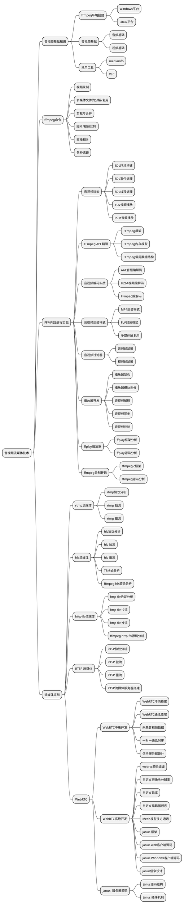

# 音视频开发思维导图

1. 这个是暂时的，后续需要不断的实践优化

```plantuml
@startmindmap

* 音视频流媒体技术
** 音视频基础知识
*** ffmpeg环境搭建
**** Windows平台
**** Linux平台
*** 音视频基础
**** 音频基础
**** 视频基础
*** 常用工具
**** mediainfo
**** VLC
** ffmpeg命令
*** 视频录制
*** 多媒体文件的分解/复用
*** 剪裁与合并
*** 图片/视频互转
*** 直播相关
*** 各种滤镜
** FFMPEG编程实战
*** 音视频渲染
**** SDL环境搭建
**** SDL事件处理
**** SDL线程处理
**** YUV视频播放
**** PCM音频播放
*** FFmpeg API 精讲
**** FFmpeg框架
**** FFmpeg内存模型
**** FFmpeg常用数据结构
*** 音视频编码实战
**** AAC音频编解码
**** H264视频编解码
**** FFmpeg编解码
*** 音视频封装格式
**** MP4封装格式
**** FLV封装格式
**** 多媒体解复用
*** 音视频过滤器
**** 音频过滤器
**** 视频过滤器
*** 播放器开发
**** 播放器架构
**** 播放器模块划分
**** 音视频解码
**** 音视频同步
**** 音视频控制
*** ffplay播放器
**** ffplay框架分析
**** ffplay源码分析
*** ffmpeg录制转码
**** ffmpeg.c框架
**** ffmpeg源码分析
** 流媒体实战
*** rtmp流媒体
**** rtmp协议分析
**** rtmp 拉流
**** rtmp 推流
*** hls流媒体
**** hls协议分析
**** hls 拉流
**** hls 推流
**** TS格式分析
**** ffmpeg hls源码分析
*** http-flv流媒体
**** http-flv协议分析
**** http-flv 拉流
**** http-flv 推流
**** ffmpeg http-flv源码分析
*** RTSP 流媒体
**** RTSP协议分析
**** RTSP 拉流
**** RTSP 推流
**** RTSP流媒体服务器搭建
*** WebRTC
**** WebRTC中级开发
***** WebRTC环境搭建
***** WebRTC通话原理
***** 采集音视频数据
***** 一对一通话时序
***** 信令服务器设计
**** WebRTC高级开发
***** webrtc源码编译
***** 自定义摄像头分辨率
***** 自定义码率
***** 自定义编码器顺序
***** Mesh模型多方通话
***** janus 框架
***** janus web客户端源码
***** janus Windows客户端源码
***** janus信令设计
**** janus  服务器源码
***** janus源码结构
***** janus 插件机制
@endmindmap
```