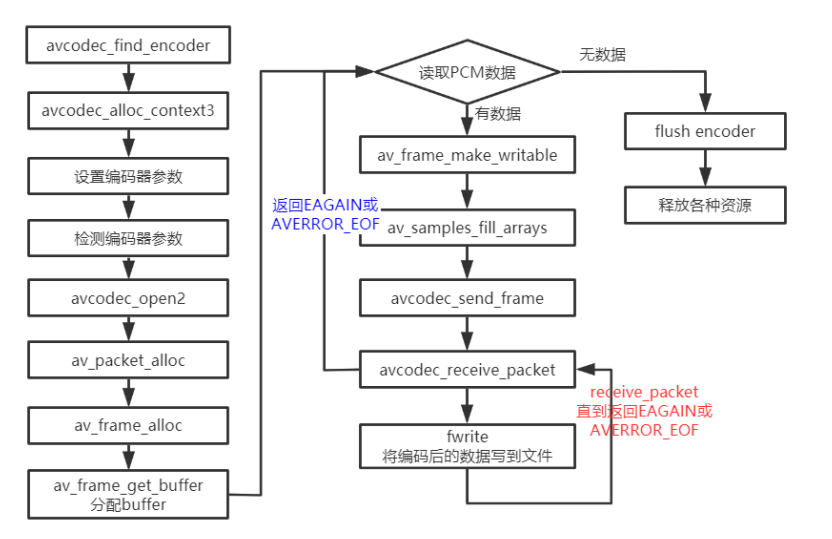
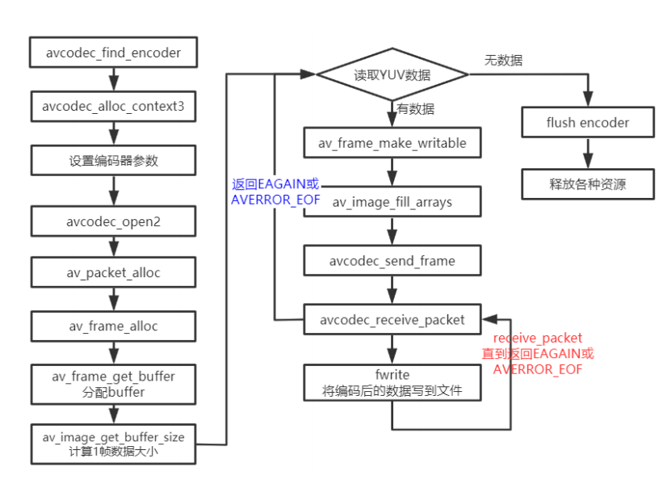

# 2.6 音视频解码实战

# 2.6.1 音视频解码器

pcm：脉冲编码调制，是一种数字音频格式，是一种无损音频格式，是一种原始音频格式，是一种未经压缩的音频格式
意思是PCM是采集到的最原始的数据，没有经过任何的压缩处理，是一种无损的音频格式，也不包含任何的音频编码信息，是一种原始的音频格式

我们这里的实战是：将PCM数据编码为AAC格式的音频数据

## 1. 整体流程



### 1.1 函数说明
+ `avcodec_find_encoder`：根据编码器名称查找编码器
+ `avcodec_alloc_context3`：分配编码器上下文
+ `avcodec_open2`：打开编码器
+ `avcodec_send_frame`：发送编码数据
+ `avcodec_receive_packet`：接收编码数据
+ `av_frame_get_buffer`：分配AVFrame的数据缓冲区
+ `av_frame_make_writable`：确保AVFrame的数据缓冲区可写
+ `av_samples_array_alloc`：分配音频数据缓冲区
  

## 2. PCM 样本格式
+ sample_rate：采样率 8KHz、16KHz、44.1KHz、48KHz
+ sample size: 量化位数 8bit、16bit、24bit
+ channel: 声道数 1单声道、2立体声
+ sign : 有符号无符号
+ byte order: 大端小端
+ integer or floating point: 整数浮点数

### 2.1 ffmpeg支持的PCM格式

我们使用ffmpeg命令查看支持的PCM格式
```shell
ffmpeg -formats 
```
s 是有符号，u 是无符号，f 是浮点数

be 是大端，le 是小端

## 3. ffmpeg中的Packed和Planar的PCM数据区别

ffmpeg中音视频数据基本上都有两种存储方式：Packed和Planar
对于双声道音频来说，Packed就是左右声道交叉存储，Planar就是左声道和右声道分开存储，数据的存储方式如下所示：
+ Packed：LRLRLRLR...
+ Planar：LLLL...RRRR...

ffmpeg默认的AAC编码器不支持AV_SAMPLE_FMT_S16P格式的音频数据，只支持AV_SAMPLE_FMT_FLTP格式的音频数据

这种格式是按照平面存储的，也就是左声道和右声道分开存储的，样点是flaot类型的。所谓的平面也就说
｜ 每个声道单独存储，比如左声道存储在一个数组中，右声道存储在另一个数组中

ffmpeg 音频解码后和解码前的数据都是存放在AVFrame结构体

### 3.1 补充说明
+ palanar模式是ffmpeg的内部存储模式，我们实际使用的音频文件都是packed模式
+ ffmpeg解码不同的音频输出的音频采样格式不是一样
+ planar或者packed模式直接影响到保存文件的时候写文件的操作，操作数据的时候一定要先检测音频的采样格式

## 4.PCM 字节序

1. 大端序（Big Endian）：
高位字节存储在低地址，低位字节存储在高地址。
例如，16位整数0x1234在大端序中存储为0x12 0x34。

2. 小端序（Little Endian）：
低位字节存储在低地址，高位字节存储在高地址。
例如，16位整数0x1234在小端序中存储为0x34 0x12。

## 5. 具体代码
```cpp

extern "C" {
#include <libavcodec/avcodec.h>
#include <libavformat/avformat.h>
#include <libswresample/swresample.h>
}

#include <iostream>
#include <fstream>

void encode(AVCodecContext *ctx, AVFrame *frame, AVPacket *pkt, std::ofstream &outfile) {
    int ret;

    // 发送帧进行编码
    ret = avcodec_send_frame(ctx, frame);
    if (ret < 0) {
        std::cerr << "Error sending the frame to the encoder" << std::endl;
        exit(1);
    }

    // 从编码器接收编码后的数据
    while (ret >= 0) {
        ret = avcodec_receive_packet(ctx, pkt);
        if (ret == AVERROR(EAGAIN) || ret == AVERROR_EOF) {
            return;
        } else if (ret < 0) {
            std::cerr << "Error during encoding" << std::endl;
            exit(1);
        }

        // 将编码后的数据写入文件
        outfile.write((char *)pkt->data, pkt->size);
        av_packet_unref(pkt);
    }
}

int main() {
    const char *pcm_filename = "input.pcm";
    const char *aac_filename = "output.aac";

    // 注册所有编解码器
    avcodec_register_all();

    // 查找AAC编码器
    const AVCodec *codec = avcodec_find_encoder(AV_CODEC_ID_AAC);
    if (!codec) {
        std::cerr << "Codec not found" << std::endl;
        exit(1);
    }

    // 分配编码器上下文
    AVCodecContext *ctx = avcodec_alloc_context3(codec);
    if (!ctx) {
        std::cerr << "Could not allocate audio codec context" << std::endl;
        exit(1);
    }

    // 设置编码参数
    ctx->bit_rate = 64000;
    ctx->sample_fmt = AV_SAMPLE_FMT_FLTP;
    ctx->sample_rate = 44100;
    ctx->channel_layout = AV_CH_LAYOUT_STEREO;
    ctx->channels = av_get_channel_layout_nb_channels(ctx->channel_layout);

    // 打开编码器
    if (avcodec_open2(ctx, codec, NULL) < 0) {
        std::cerr << "Could not open codec" << std::endl;
        exit(1);
    }

    // 分配帧和数据包
    AVFrame *frame = av_frame_alloc();
    if (!frame) {
        std::cerr << "Could not allocate audio frame" << std::endl;
        exit(1);
    }
    frame->nb_samples = ctx->frame_size;
    frame->format = ctx->sample_fmt;
    frame->channel_layout = ctx->channel_layout;

    int ret = av_frame_get_buffer(frame, 0);
    if (ret < 0) {
        std::cerr << "Could not allocate audio data buffers" << std::endl;
        exit(1);
    }

    AVPacket *pkt = av_packet_alloc();
    if (!pkt) {
        std::cerr << "Could not allocate AVPacket" << std::endl;
        exit(1);
    }

    // 打开输入PCM文件
    std::ifstream pcm_file(pcm_filename, std::ios::binary);
    if (!pcm_file.is_open()) {
        std::cerr << "Could not open input PCM file" << std::endl;
        exit(1);
    }

    // 打开输出AAC文件
    std::ofstream aac_file(aac_filename, std::ios::binary);
    if (!aac_file.is_open()) {
        std::cerr << "Could not open output AAC file" << std::endl;
        exit(1);
    }

    // 编码PCM数据为AAC
    while (pcm_file.read((char *)frame->data[0], frame->linesize[0])) {
        encode(ctx, frame, pkt, aac_file);
    }

    // 发送空帧以刷新编码器
    encode(ctx, NULL, pkt, aac_file);

    // 清理资源
    pcm_file.close();
    aac_file.close();
    av_frame_free(&frame);
    av_packet_free(&pkt);
    avcodec_free_context(&ctx);

    std::cout << "Encoding completed successfully" << std::endl;
    return 0;
}

```

# 2.6.2 视频解码器

yuv：是一种原始的视频格式，是一种未经压缩的视频格式，是一种无损视频格式

我们这里的实战是：将YUV数据编码为H.264格式的视频数据

## 1. 整体流程



### 1.1 函数说明
+ `avcodec_find_encoder`：根据编码器名称查找编码器
+ `avcodec_alloc_context3`：分配编码器上下文
+ `avcodec_open2`：打开编码器
+ `avcodec_send_frame`：发送编码数据
+ `avcodec_receive_packet`：接收编码数据
+ `av_frame_get_buffer`：分配AVFrame的数据缓冲区
+ `av_frame_make_writable`：确保AVFrame的数据缓冲区可写
+ `av_image_fill_arrays`：填充AVFrame的数据缓冲区
  
编码完成的H264数据可以使用FFmpeg的ffplay播放器进行播放

## 2. H264的码率设置

1. 什么是码率？
码率是指单位时间内传送的数据量，单位是bps（比特每秒）

2. 设置视频码率的目的
视频码率是视频压缩的重要参数，它决定了视频的清晰度和画质，码率越高，画质越好，但是文件也越大

是不是码率越高越好呢？不是的，码率越高，画质越好，但是文件也越大，码率越低，画质越差，但是文件也越小

3. 建议的码率设置
| 序号 | 分辨率 | 码率 |
| --- | --- | --- |
| 1 | 1920x1080 | 800Kbps - 5000Kbps |
| 2 | 1280x720 | 500Kbps - 2500Kbps |
| 3 | 720x480 | 250Kbps - 1000Kbps |
| 4 | 640x480 | 250Kbps - 1000Kbps |
| 5 | 352x288 | 250Kbps - 500Kbps |

## 3. CRF（Constant Rate Factor）常量质量因子

1. 什么是CRF？
CRF是一种视频压缩参数，它是一种基于质量的压缩方式，CRF越小，画质越好，文件越大，CRF越大，画质越差，文件越小

2. CRF的取值范围
CRF的取值范围是0-51，其中0是无损压缩，51是最差的压缩质量

3. 建议的CRF设置
| 序号 | 分辨率 | CRF |
| --- | --- | --- |
| 1 | 1920x1080 | 18 - 28 |
| 2 | 1280x720 | 18 - 28 |
| 3 | 720x480 | 18 - 28 |
| 4 | 640x480 | 18 - 28 |

4. 选择一个合适的CRF
量化比例的范围是0-51，其中0是无损压缩，51是最差的压缩质量，一般情况下，我们选择一个合适的CRF值，比如18-28之间

### 选择一个preset和tune

1. 什么是preset？
preset是指编码速度和压缩效率的平衡，preset越快，压缩效率越低，preset越慢，压缩效率越高

2. 什么是tune？
tune是指编码器的优化参数，tune可以根据不同的场景选择不同的优化参数，比如film、animation、grain等
| 序号 | 场景 | 说明 |
| --- | --- | --- |
| 1 | film | 适用于电影场景 |
| 2 | animation | 适用于动画场景 |
| 3 | grain | 适用于颗粒场景 |
| 4 | stillimage | 适用于静态图像场景 |
| 5 | fastdecode | 适用于快速解码场景 |
| 6 | zerolatency | 适用于零延迟场景 |

### profile

另外⼀个可选的参数是-profile:v，它可以将你的输出限制到⼀个特定的 H.264 profile。⼀些⾮常⽼的或者
要被淘汰的设备仅⽀持有限的选项，⽐如只⽀持baseline或者main。
所有的profile 包括：
1. baseline profile：基本画质。⽀持I/P 帧，只⽀持⽆交错（Progressive）和CAVLC；
2. extended profile：进阶画质。⽀持I/P/B/SP/SI 帧，只⽀持⽆交错（Progressive）和CAVLC；
3. main profile：主流画质。提供I/P/B 帧，⽀持⽆交错（Progressive）和交错（Interlaced），也⽀持
CAVLC 和CABAC 的⽀持；
4. high profile：⾼级画质。在main Profile 的基础上增加了8x8内部预测、⾃定义量化、 ⽆损视频编码
和更多的YUV 格式；
想要说明H.264 high profile与H.264 main profile的区别就要讲到H.264的技术发展了。JVT于2003
年完成H.264基本部分标准制定⼯作，包含baseline profile、extended profile和main profile，分别包括
不同的编码⼯具。之后JVT⼜完成了H.264 FRExt（即：Fidelity Range Extensions）扩展部分
（Amendment）的制定⼯作，包括high profile（HP）、high 10 profile（Hi10P）、high 4:2:2
profile（Hi422P）、high 4:4:4 profile（Hi444P）4个profile。
H.264 baseline profile、extended profile和main profile都是针对8位样本数据、4:2:0格式的视频序
列，FRExt将其扩展到8～12位样本数据，视频格式可以为4:2:0、4:2:2、4:4:4，设⽴了high
profile（HP）、high 10 profile（Hi10P）、high 4:2:2 profile（Hi422P）、high 4:4:4
profile（Hi444P） 4个profile，这4个profile都以main profile为基础。
在相同配置情况下，High profile（HP）可以⽐Main profile（MP）节省10%的码流量，⽐MPEG-2
MP节省60%的码流量，具有更好的编码性能。根据应⽤领域的不同：
baseline profile多应⽤于实时通信领域；
main profile多应⽤于流媒体领域；
high profile则多应⽤于⼴电和存储领域。

## 4. 具体代码
```cpp
extern "C" {
#include <libavcodec/avcodec.h>
#include <libavformat/avformat.h>
#include <libswscale/swscale.h>
}

#include <iostream>
#include <fstream>

void encode(AVCodecContext *ctx, AVFrame *frame, AVPacket *pkt, std::ofstream &outfile) {
    int ret;

    // 发送帧进行编码
    ret = avcodec_send_frame(ctx, frame);
    if (ret < 0) {
        std::cerr << "Error sending the frame to the encoder" << std::endl;
        exit(1);
    }

    // 从编码器接收编码后的数据
    while (ret >= 0) {
        ret = avcodec_receive_packet(ctx, pkt);
        if (ret == AVERROR(EAGAIN) || ret == AVERROR_EOF) {
            return;
        } else if (ret < 0) {
            std::cerr << "Error during encoding" << std::endl;
            exit(1);
        }

        // 将编码后的数据写入文件
        outfile.write((char *)pkt->data, pkt->size);
        av_packet_unref(pkt);
    }
}

int main() {
    const char *yuv_filename = "input.yuv";
    const char *h264_filename = "output.h264";

    // 注册所有编解码器
    avcodec_register_all();

    // 查找H.264编码器
    const AVCodec *codec = avcodec_find_encoder(AV_CODEC_ID_H264);
    if (!codec) {
        std::cerr << "Codec not found" << std::endl;
        exit(1);
    }

    // 分配编码器上下文
    AVCodecContext *ctx = avcodec_alloc_context3(codec);
    if (!ctx) {
        std::cerr << "Could not allocate video codec context" << std::endl;
        exit(1);
    }

    // 设置编码参数
    ctx->bit_rate = 400000;
    ctx->width = 640;
    ctx->height = 480;
    ctx->time_base = (AVRational){1, 25};
    ctx->framerate = (AVRational){25, 1};
    ctx->gop_size = 10;
    ctx->max_b_frames = 1;
    ctx->pix_fmt = AV_PIX_FMT_YUV420P;

    // 打开编码器
    if (avcodec_open2(ctx, codec, NULL) < 0) {
        std::cerr << "Could not open codec" << std::endl;
        exit(1);
    }

    // 分配帧和数据包
    AVFrame *frame = av_frame_alloc();
    if (!frame) {
        std::cerr << "Could not allocate video frame" << std::endl;
        exit(1);
    }
    frame->format = ctx->pix_fmt;
    frame->width = ctx->width;
    frame->height = ctx->height;

    int ret = av_frame_get_buffer(frame, 32);
    if (ret < 0) {
        std::cerr << "Could not allocate the video frame data" << std::endl;
        exit(1);
    }

    AVPacket *pkt = av_packet_alloc();
    if (!pkt) {
        std::cerr << "Could not allocate AVPacket" << std::endl;
        exit(1);
    }

    // 打开输入YUV文件
    std::ifstream yuv_file(yuv_filename, std::ios::binary);
    if (!yuv_file.is_open()) {
        std::cerr << "Could not open input YUV file" << std::endl;
        exit(1);
    }

    // 打开输出H.264文件
    std::ofstream h264_file(h264_filename, std::ios::binary);
    if (!h264_file.is_open()) {
        std::cerr << "Could not open output H.264 file" << std::endl;
        exit(1);
    }

    // 编码YUV数据为H.264
    int y_size = ctx->width * ctx->height;
    while (yuv_file.read((char *)frame->data[0], y_size)) {
        yuv_file.read((char *)frame->data[1], y_size / 4);
        yuv_file.read((char *)frame->data[2], y_size / 4);

        frame->pts = frame->coded_picture_number++;
        encode(ctx, frame, pkt, h264_file);
    }

    // 发送空帧以刷新编码器
    encode(ctx, NULL, pkt, h264_file);

    // 清理资源
    yuv_file.close();
    h264_file.close();
    av_frame_free(&frame);
    av_packet_free(&pkt);
    avcodec_free_context(&ctx);

    std::cout << "Encoding completed successfully" << std::endl;
    return 0;
}
```