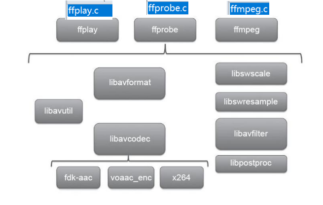
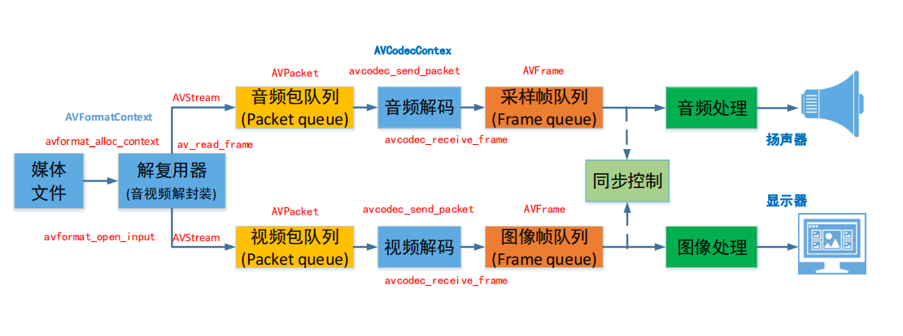
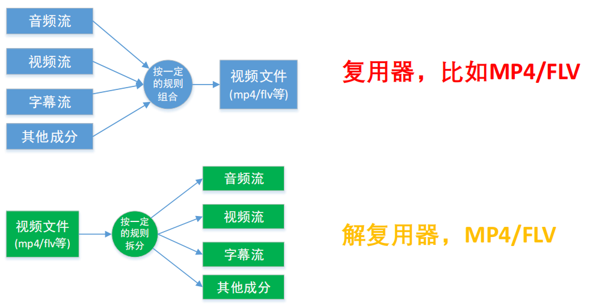
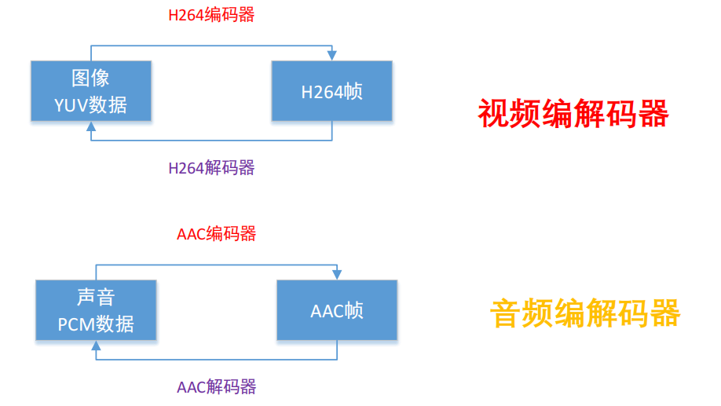

# FFMPEG的简介

## 1. FFMPEG的简介

FFmpeg是一个开源的多媒体处理工具，支持音频、视频的录制、转换和流处理。

FFmpeg即是一款一视频编解码工具，同时也是一组音视频编解码开发套件，作为编解码开发套件，他为开发者提供了丰富的API，可以方便的实现音视频的编解码、封装和解封装等操作。

+ ffmpeg 支持几乎所有的音视频格式。
+ ffmpeg跨平台，支持Windows、Linux、Mac等操作系统。
+ ffmpeg提供了丰富的工具和库来处理多媒体数据。

## 2. ffmepeg主要学习的内容

1. ffmpeg的命令行的学习
2. 编解码的学习
3. 封装和解封装的学习
4. 滤镜的学习
5. 设备的捕获和播放的学习
6. 图像缩放和色彩空间转换的学习
7. 音频重采样的学习
8. 笔记当中就不写代码了，[学习ffmpeg的GitHub项目](https://github.com/ZhanghHaoDev/ffmpeg_stu.git)
9. ffmpeg的官方例子，[ffmpeg的官方例子](https://ffmpeg.org/doxygen/trunk/examples.html)

## 3. ffmpeg的安装

### 3.1 Windows下的安装

1. 下载ffmpeg的压缩包，解压到指定目录。
2. 配置环境变量。

### 3.2 Linux下的安装

```shell
sudo apt-get install ffmpeg
```

### 3.3 Mac下的安装

```shell
brew install ffmpeg
```

### 3.4 源码安装

源码安装需要NASM 或 YASM，这两个是汇编语言编译器，ffmpeg的一些编码器是用汇编语言编写的，所以需要安装这两个编译器。

```shell
sudo apt-get update
sudo apt-get install nasm
sudo apt-get install yasm
```

```shell
git clone https://git.ffmpeg.org/ffmpeg.git ffmpeg
cd ffmpeg
./configure
make
sudo make install
```

1. 查看ffmpeg支持的编码器

```shell
./configure --list-encoders
```

2. 查看ffmpeg支持的解码器

```shell
./configure --list-decoders
```

3. 查看ffmpeg的封装支持
```shell
./configure --list-muxers
```

4. 查看ffmpeg的解封装支持
```shell
./configure --list-demuxers
```

5. 查看ffmpeg的通信协议支持
```shell
./configure --list-protocols
```

## 4. ffmpeg的开发

[ffmpeg文档](https://ffmpeg.org/doxygen/trunk/)
[FFMpeg SDK 开发手册 (hyf) (Z-Library)](../PDF/FFMpeg%20SDK%20开发手册%20(hyf)%20(Z-Library).pdf)

### 4.1 ffmpeg库当中的模块



ffmpeg的开发主要是基于ffmpeg的库进行开发，主要包括以下几个库：
+ **AVUtil**：核心工具库，许多其他模块都会依赖该库进行基本的音视频处理操作。
+ **AVFormat**：用于封装和解封装多媒体容器格式，文件格式和协议库，是FFmpeg中最重要的模块之一，封装了Protocol层和Demuxer、Muxer层，使得协议和格式对于开发人员来说是透明的。
+ **AVCodec**：编解码库，封装了Codec层，但有一些Codec是具备自己的License的，FFmpeg不会默认添加如libx264、FDK-AAC等库。FFmpeg像一个平台，可以将其他第三方的Codec以插件的方式添加进来，为开发者提供统一的接口。
+ **AVFilter**：音视频滤镜库，提供包括音频特效和视频特效的处理。在使用FFmpeg的API进行编解码的过程中，直接使用该模块为音视频数据做特效处理是非常方便且高效的方式。
+ **AVDevice**：输入输出设备库，例如需要编译出播放声音或者视频的工具ffplay，需要确保该模块是打开的，同时也需要SDL的预先编译，因为该设备模块播放声音与播放视频使用的都是SDL库。
+ **SwrResample**：音频重采样模块，可以对数字音频进行声道数、数据格式、采样率等多种基本信息的转换。
+ **SwScale**：图像格式转换模块，可以将YUV数据转换为RGB数据，进行缩放尺寸等操作。
+ **PostProc**：后期处理模块，当使用AVFilter时需要打开该模块的开关，因为Filter中会使用到该模块的一些基本函数。

### 4.2 ffmpeg与cmake

使用源码安装ffmpeg，安装的路径为系统目录

会输出ffmpeg的版本和路径信息，这个适用与Linux下的

```cmake
cmake_minimum_required(VERSION 3.20)
project(ffmpeg)

set(CMAKE_CXX_STANDARD 14)
set(CMAKE_EXPORT_COMPILE_COMMANDS ON)
add_definitions(-D__STDC_CONSTANT_MACROS)

# 查找FFmpeg库
find_package(PkgConfig REQUIRED)
pkg_check_modules(AVFORMAT REQUIRED libavformat)
pkg_check_modules(AVCODEC REQUIRED libavcodec)
pkg_check_modules(AVUTIL REQUIRED libavutil)
pkg_check_modules(SWSCALE REQUIRED libswscale)

# 打印FFmpeg库的路径和版本信息
message(STATUS "FFmpeg libavformat include dirs: ${AVFORMAT_INCLUDE_DIRS}")
message(STATUS "FFmpeg libavformat library dirs: ${AVFORMAT_LIBRARY_DIRS}")
message(STATUS "FFmpeg libavformat libraries: ${AVFORMAT_LIBRARIES}")
message(STATUS "FFmpeg libavformat version: ${AVFORMAT_VERSION}")

message(STATUS "FFmpeg libavcodec include dirs: ${AVCODEC_INCLUDE_DIRS}")
message(STATUS "FFmpeg libavcodec library dirs: ${AVCODEC_LIBRARY_DIRS}")
message(STATUS "FFmpeg libavcodec libraries: ${AVCODEC_LIBRARIES}")
message(STATUS "FFmpeg libavcodec version: ${AVCODEC_VERSION}")

message(STATUS "FFmpeg libavutil include dirs: ${AVUTIL_INCLUDE_DIRS}")
message(STATUS "FFmpeg libavutil library dirs: ${AVUTIL_LIBRARY_DIRS}")
message(STATUS "FFmpeg libavutil libraries: ${AVUTIL_LIBRARIES}")
message(STATUS "FFmpeg libavutil version: ${AVUTIL_VERSION}")

message(STATUS "FFmpeg libswscale include dirs: ${SWSCALE_INCLUDE_DIRS}")
message(STATUS "FFmpeg libswscale library dirs: ${SWSCALE_LIBRARY_DIRS}")
message(STATUS "FFmpeg libswscale libraries: ${SWSCALE_LIBRARIES}")
message(STATUS "FFmpeg libswscale version: ${SWSCALE_VERSION}")

# 添加可执行文件
add_executable(ffmpeg main.cpp)

# 链接FFmpeg库
target_include_directories(ffmpeg PRIVATE ${AVFORMAT_INCLUDE_DIRS} ${AVCODEC_INCLUDE_DIRS} ${AVUTIL_INCLUDE_DIRS} ${SWSCALE_INCLUDE_DIRS})
target_link_libraries(ffmpeg ${AVFORMAT_LIBRARIES} ${AVCODEC_LIBRARIES} ${AVUTIL_LIBRARIES} ${SWSCALE_LIBRARIES})
```

## 5. 播放器的开发

1. 容器/文件：即特定格式的多媒体文件，比如MP4，flv等
2. 媒体流：表示时间轴上一段连续数据，如一段声音数据，一段视频数据或一段字幕数据，可以说压缩的，也可以说非压缩的，压缩的数据需要关联特定的编码器和解码器
3. 数据帧/数据包：通常，一个媒体流是由大量的数据帧组成的，对于压缩数据，帧对应着编解码器的最小处理单元，分属于不同的媒体流的数据帧交错存储于容器当中
4. 编解码器：编解码器是以帧为单位实现压缩数据和原始数据之间的相互转换的

播放器的开发框架



常用概念-复用器



常用概念-编解码器




## 6. 常用的音视频封装格式

| 序号 | 封装格式 | 描述 
| ---- | --- | ------ |
| 1    | FLV      | Flash Video，流媒体格式，适合网络视频播放 |
| 2    | MP4      | MPEG-4 Part 14，多媒体容器格式，广泛用于存储音视频 |
| 3    | AVI      | Audio Video Interleave，微软公司开发的多媒体容器格式 |
| 4    | MKV      | Matroska，开源的多媒体容器格式，支持多种编码 |
| 5    | RMVB     | RealMedia Variable Bitrate，RealPlayer的流媒体格式 | 
| 6    | MOV      | QuickTime Movie，苹果公司开发的多媒体容器格式 |
| 7    | WMV      | Windows Media Video，微软公司开发的视频编码格式 |
| 8    | TS       | Transport Stream，传输流格式，用于数字电视广播 |
| 9    | M3U8     | M3U8是一种基于HTTP Live Streaming协议的视频流媒体播放列表文件格式 |
| 10   | WEBM     | WebM是一种开放、免费的多媒体文件格式，主要用于网络视频 |
| 11   | OGG      | Ogg是一种自由、开放的多媒体容器格式，支持音频、视频、字幕等 |
| 12  | ASF      | Advanced Systems Format，微软公司开发的多媒体容器格式 |
| 13  | 3GP      | 3rd Generation Partnership Project，第三代合作伙伴计划 |
| 14  | MPG      | MPEG-1或MPEG-2的视频文件格式 |
| 15  | RM       | RealMedia，RealPlayer的流媒体格式 |
| 16  | VOB      | DVD Video Object，DVD视频文件格式 |
| 17  | DAT      | VCD视频文件格式 |
| 18  | AMR      | Adaptive Multi-Rate，一种音频编码格式 |
| 19  | MP3      | MPEG-1 Audio Layer III，一种音频编码格式 |
| 20  | AAC      | Advanced Audio Coding，一种音频编码格式 |
| 21  | WAV      | Waveform Audio File Format，一种音频文件格式 |
| 22  | WMA      | Windows Media Audio，一种音频编码格式 |
| 23  | FLAC     | Free Lossless Audio Codec，一种无损音频编码格式 |
| 24  | APE      | Monkey's Audio，一种无损音频编码格式 |
| 25 | AC3 | Dolby Digital，杜比数字音频编码格式 |
| 26 | PCM | Pulse Code Modulation，脉冲编码调制，一种音频编码格式 |