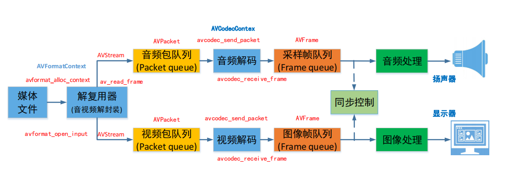
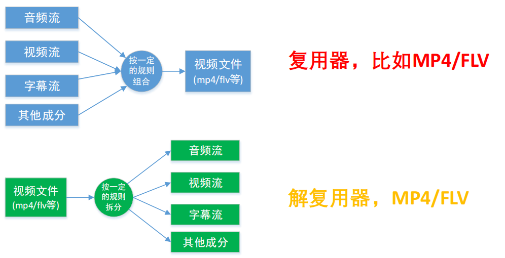
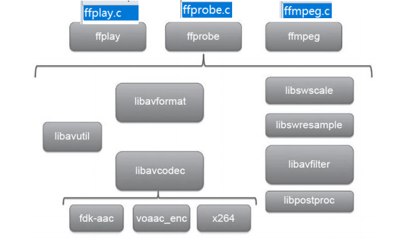

# 2.2 ffmpeg的基础开发

# ffmpeg的安装

## 1. ffmpeg 的简介

`FFmpeg` 是一个开源的多媒体框架，可以用来录制、转换和流式传输音视频。它支持几乎所有已知的音视频格式，并且提供了丰富的工具和库来处理多媒体数据。以下是 `FFmpeg` 的一些关键特性和常用工具的简介：

### 关键特性

1. 多格式支持：支持几乎所有的音视频格式，包括但不限于 MP4、AVI、MKV、MP3、AAC、FLAC 等。
2. 高效编码和解码：提供高效的编码和解码功能，支持硬件加速。
3. 多媒体处理：支持视频剪辑、合并、滤镜、字幕、音频处理等多种操作。
4. 跨平台：支持多种操作系统，包括 Windows、Linux、macOS 等。

### 常用工具

1. ffmpeg：主要的命令行工具，用于录制、转换和流式传输音视频。
2. ffplay：一个简单的媒体播放器，用于播放音视频文件。
3. ffprobe：一个多媒体流分析工具，用于获取音视频文件的详细信息。
4. ffmepg 的安装

## 2. Linux 上的安装

建议直接源码安装

源码安装完了以后，省事的话，可以将 ffmpeg 的安装目录添加到环境变量，没有权限的情况下，需要在 cmake 当中指定 ffmpeg 的头文件和库文件的路径

```bash
# 安装依赖
sudo apt update
sudo apt install yasm

# 下载ffmpeg的源码
git clone https://git.ffmpeg.org/ffmpeg.git ffmpeg
cd ffmpeg

# 配置和编译
./configure
# 编译
make -j
sudo make install

# 验证安装成功
ffmpeg -version
```


# 1. 播放器框架



# 2. 常见音视频概念

1. 容器/文件：即特定格式的多媒体文件，比如MP4，flv等
2. 媒体流：表示时间轴上一段连续数据，如一段声音数据，一段视频数据或一段字幕数据，可以说压缩的，也可以说非压缩的，压缩的数据需要关联特定的编码器和解码器
3. 数据帧/数据包：通常，一个媒体流是由大量的数据帧组成的，对于压缩数据，帧对应着编解码器的最小处理单元，分属于不同的媒体流的数据帧交错存储于容器当中
4. 编解码器：编解码器是以帧为单位实现压缩数据和原始数据之间的相互转换的

# 2.1. 常用概念-复用器



# 2.2. 常用概念-编解码器


# 3. ffmpeg常用API简介

# 3.1. ffmpeg库的整体结构



# 3.2. ffmpeg库简介

ffmpeg有8个常用库

1. AVUtil：核心工具库，下面的许多其他模块都会依赖该库做一些基本的音视频处理操作
2. **AVFormat**：文件格式和协议库，该模块三最重要的模块之一，封装了Protocol层和Demuxer，Muxer层，使得协议和格式对于开发人员来说是透明的
3. **AVCodec**：编解码库，封装了Codec层，但是有一些Codec是具备自己的License的，FFmpeg是不会默认添加像libx264,FDK-AAC等库的，但是FFmpeg就像是一个平台一样，，可以将其他的第三方的Codec以插件的方式添加进来，然后为开发者提供统一的接口
4. AVFilter：音视频滤镜库，该模块提供了包括音频特效和视频特效的处理，在使用FFmpeg的API进行编解码的过程中，直接使用该模块为音视频数据做特效处理是非常方便同时也是高效的方式
5. AVDevice：输入输出设备库，比如：需要编译出播放声音或者视频的工具ffplay，将需要确保该模块是打开的，同时也需要SDL的预先编译，因为该设备模块播放声音与播放视频使用的都是SDL库
6. **SwrRessample**：该模块可用与音频重采样，可以对数字音频进行声道数，数据格式，采样率等多种基本信息的转换
7. **SWScale**：该模块三将图像进行格式转换的模块，比如，可以将YUV的数据转换为RGB的数据，缩放尺寸等操作
8. PostProc：该模块可用与进行后期处理，当我们使用AVFilter的时候需要打开该模块的开关，因为Filter中会使用到该模块的一些基本函数

# 3.3. FFmpeg函数简介

1. avdevice_register_all()对设备进行注册，比如V4L2等
2. avformat_network_init();初始化网络库以及网络加密协议相关的库

### 3.3.1. ffmpeg函数简介-封装函数


### 3.3.2. FFmepg-解码函数-解码器相关

1. avcodec_alloc_context3(): 分配解码器上下文
2. avcodec_find_decoder()：根据ID查找解码器
3. avcodec_find_decoder_by_name():根据解码器名字
4. avcodec_open2()： 打开编解码器
5. avcodec_send_packet(): 发送编码数据包
6. avcodec_receive_frame(): 接收解码后数据
7. avcodec_free_context():释放解码器上下文，包含了 avcodec_close()
8. avcodec_close():关闭解码器

### 3.3.3. FFmpeg解码函数简介-解码器相关


# 4. ffmpeg常用结构体简介

# 4.1. FFmepg数据结构简介

AVFormatContext：封装格式上下文结构体，也是统领全局的结构体，保存了视频文件封装格式相关信息

AVInputFormat demuxer 	AVOutputFrmat muxer：每种封装格式（FLV，MP4）对应一个该结构体

AVStream：视频文件中每个视频（音频）流对应一个该结构体

AVCodecContext：编解码器上下文结构体，保存了视频（音频）编解码相关信息

AVCodec：每种视频（音频）编解码器对应一个该结构体

AVPacket：存储一帧压缩编码数据

AVFrame：存储一帧解码后像素（采样）数据

# 4.2. FFmpeg数据结构之间的关系

1. AVFormatContext和AVInputFormat之间的关系

AVFormatContext API 调用 AVInputFormat主要是FFMPEG内部调用

1. AVCodecContext和AVCodec之间的关系


1. AVFormatContext, AVStream和AVCodecContext之间的关系


1. 区分不同的码流

AVMEDIA_TYPE_VIDEO视频流：

```cpp
video_index = av_find_best_stream(ic, AVMEDIA_TYPE_VIDEO,
    -1,-1, NULL, 0)
```

AVMEDIA_TYPE_AUDIO音频流

```cc
audio_index = av_find_best_stream(ic, AVMEDIA_TYPE_AUDIO,
-1,-1, NULL, 0)
```

1. AVPacket和AVFrame之间的关系
   


# 4.3. FFmepg数据结构分析

1. AVFormatContext

iformat：输入媒体的AVInputFormat，比如指向AVInputFormat ff_flv_demuxer

nb_streams：输入媒体的AVStream 个数

streams：输入媒体的AVStream []数组

duration：输入媒体的时长（以微秒为单位），计算方式可以参考av_dump_format()函数。

bit_rate：输入媒体的码率

1. AVInputFormat

nam：封装格式的名称

extensions：封装格式的扩展名

id ：封装格式的ID

一些封装格式处理的接口函数，比如read_packet()

1. AVStream

index：标识该视频/音频流

time_base：该流的时基，PTS*time_base=真正的时间（秒）

avg_frame_rate： 该流的帧率

duration：该视频/音频流长度

codecpar：编解码器参数属性

1. AVCodeParameters

codec_type：媒体类型，比如AVMEDIA_TYPE_VIDEO AVMEDIA_TYPE_AUDIO等

codec_id：编解码器类型， 比如AV_CODEC_ID_H264 AV_CODEC_ID_AAC等。

1. AVCodecContext

codec：编解码器的AVCodec，比如指向AVCodec ff_aac_latm_decoder

width, height：图像的宽高（只针对视频）

pix_fmt：像素格式（只针对视频）

sample_rate：采样率（只针对音频）

channels：声道数（只针对音频）

sample_fmt：采样格式（只针对音频）

1. AVCodec

name：编解码器名称

type：编解码器类型

id：编解码器ID

一些编解码的接口函数，比如int (*decode)()

1. AVPacket

pts：显示时间戳

dts：解码时间戳

data：压缩编码数据

size：压缩编码数据大小

pos:数据的偏移地址

stream_index：所属的AVStream

1. AVFrame

data：解码后的图像像素数据（音频采样数据）

linesize：对视频来说是图像中一行像素的大小；对音频来说是整个音频帧的大小

width, height：图像的宽高（只针对视频）

key_frame：是否为关键帧（只针对视频） 。

pict_type：帧类型（只针对视频） 。例如I， P， B

sample_rate：音频采样率（只针对音频）

nb_samples：音频每通道采样数（只针对音频）

pts：显示时间戳

# 5. 常见的音视频封装格式

| 序号 | 封装格式 | 描述 
| ---- | --- | ------ |
| 1    | FLV      | Flash Video，流媒体格式，适合网络视频播放 |
| 2    | MP4      | MPEG-4 Part 14，多媒体容器格式，广泛用于存储音视频 |
| 3    | AVI      | Audio Video Interleave，微软公司开发的多媒体容器格式 |
| 4    | MKV      | Matroska，开源的多媒体容器格式，支持多种编码 |
| 5    | RMVB     | RealMedia Variable Bitrate，RealPlayer的流媒体格式 |
| 6    | MOV      | QuickTime Movie，苹果公司开发的多媒体容器格式 |
| 7    | WMV      | Windows Media Video，微软公司开发的视频编码格式 |
| 8    | TS       | Transport Stream，传输流格式，用于数字电视广播 |
| 9    | M3U8     | M3U8是一种基于HTTP Live Streaming协议的视频流媒体播放列表文件格式 |
| 10   | WEBM     | WebM是一种开放、免费的多媒体文件格式，主要用于网络视频 |
| 11   | OGG      | Ogg是一种自由、开放的多媒体容器格式，支持音频、视频、字幕等 |
| 12  | ASF      | Advanced Systems Format，微软公司开发的多媒体容器格式 |
| 13  | 3GP      | 3rd Generation Partnership Project，第三代合作伙伴计划 |
| 14  | MPG      | MPEG-1或MPEG-2的视频文件格式 |
| 15  | RM       | RealMedia，RealPlayer的流媒体格式 |
| 16  | VOB      | DVD Video Object，DVD视频文件格式 |
| 17  | DAT      | VCD视频文件格式 |
| 18  | AMR      | Adaptive Multi-Rate，一种音频编码格式 |
| 19  | MP3      | MPEG-1 Audio Layer III，一种音频编码格式 |
| 20  | AAC      | Advanced Audio Coding，一种音频编码格式 |
| 21  | WAV      | Waveform Audio File Format，一种音频文件格式 |
| 22  | WMA      | Windows Media Audio，一种音频编码格式 |
| 23  | FLAC     | Free Lossless Audio Codec，一种无损音频编码格式 |
| 24  | APE      | Monkey's Audio，一种无损音频编码格式 |
|25 | AC3 | Dolby Digital，杜比数字音频编码格式 |
｜ 26｜ PCM | Pulse Code Modulation，脉冲编码调制，一种音频编码格式 |
