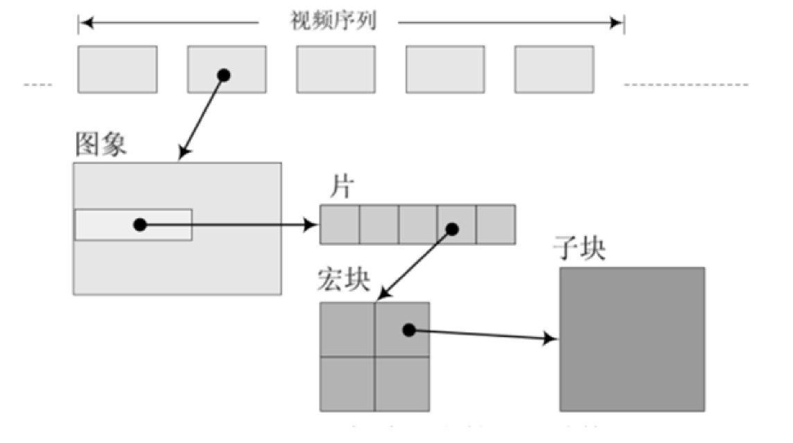
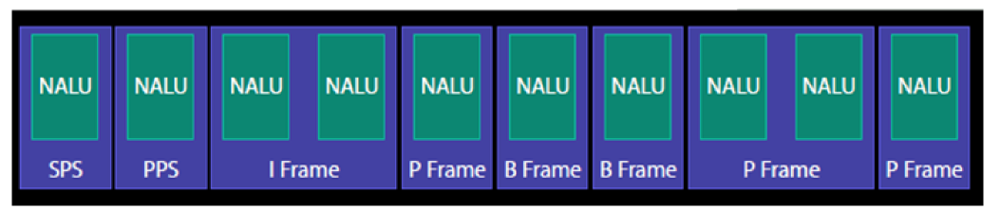

# 2.4 H264编码格式分析

[H264 NALU分析.pdf](../PDF/H264%20NALU分析.pdf)

音视频，不管是视频还是音频的数据，封装层级结构都遵循下面的封装格式：**最下面的是原始数据，上面的是编码。然后说封装，最后是协议**，所以我们获取到数据以后也是遵循封装的格式，先说解析协议，然后是解析封装格式，然后是解析编码，最后就获取了原始数据。

# 1. H264 编码简介

**H.264 编码的结构可以分为多个层次，从底层到高层依次是 NALU、帧（I 帧、P 帧、B 帧）和 GOP（Group of Pictures）。**

- **帧（Frame）：一个帧可以包含多个 NALU。**
- **片（Slice）：一个片通常对应一个 NALU，片的编码数据被封装在 NALU 的 RBSP 中。**
- **宏块（Macroblock）：片由多个宏块组成，宏块的编码数据也是片的一部分。**
- **子块（Sub-block）：宏块可以进一步划分为子块，子块的编码数据包含在宏块中。**

H.264（也称为 AVC，Advanced Video Coding）是一种广泛使用的视频压缩标准，由国际电信联盟（ITU-T）的视频编码专家组（VCEG）和国际标准化组织/国际电工委员会（ISO/IEC）的运动图像专家组（MPEG）联合开发。

### 视频编码的历史：

1. H.26x 系列H.264 / AVC：广泛用于蓝光光盘、网络视频流、高清电视和视频会议。H.265 / HEVC：用于 4K 和 8K 超高清电视、视频流和视频会议。H.266 / VVC：用于 8K 超高清电视和未来的视频应用。
2. MPEG 系列MPEG-2：用于数字电视广播和 DVD。MPEG-4：用于互联网视频、移动视频和数字电视。
3. VPx 系列VP8：用于网络视频流（如 WebM）。VP9：用于 YouTube 和其他网络视频流。
4. 现代编码标准AV1：由 AOM 发布，主要用于网络视频流，旨在替代 H.265 和 VP9

### 主要特点

1. 高压缩效率：H.264 提供了比之前的视频编码标准（如 MPEG-2 和 H.263）更高的压缩效率，能够在相同的图像质量下显著减少数据量。
2. 灵活性：支持多种分辨率和帧率，从低分辨率的移动设备视频到高分辨率的高清电视和蓝光光盘。
3. 网络友好：设计上考虑了在不同网络环境下的传输需求，适用于互联网视频流、视频会议、广播电视等多种应用场景。

### 技术细节

1. 帧内预测（Intra Prediction）：利用当前帧内的像素信息进行预测，减少空间冗余。
2. 帧间预测（Inter Prediction）：利用前后帧的像素信息进行预测，减少时间冗余。
3. 变换编码（Transform Coding）：使用整数离散余弦变换（DCT）将像素值转换为频域表示，便于压缩。
4. 熵编码（Entropy Coding）：采用 CABAC（上下文自适应二进制算术编码）或 CAVLC（上下文自适应可变长编码）进行无损压缩。
5. 去块效应滤波（Deblocking Filter）：在解码过程中应用滤波器，减少块效应，提高图像质量。

### 应用场景

1. 视频流媒体：如 YouTube、Netflix 等在线视频平台。
2. 视频会议：如 Zoom、Microsoft Teams 等视频会议软件。
3. 数字电视和广播：如高清电视（HDTV）和蓝光光盘。
4. 移动视频：如智能手机上的视频播放和录制。

### 优势

- 高效压缩：在相同的图像质量下，H.264 的压缩效率比 MPEG-2 高出一倍以上。
- 广泛支持：几乎所有现代的视频播放设备和软件都支持 H.264 编码。

### 劣势

- 计算复杂度高：编码和解码过程需要较高的计算能力，可能对低性能设备不友好。
- 专利问题：H.264 涉及多项专利，使用时可能需要支付专利费用。

总之，H.264 是一种高效、灵活且广泛应用的视频编码标准，适用于多种视频传输和存储场景。

# 2. H264 编码的原理

H.264（也称为 AVC，Advanced Video Coding）是一种高效的视频压缩标准。它通过多种技术手段来减少视频数据的冗余，从而实现高效的压缩。以下是 H.264 编码的主要原理和步骤：

1. 分块处理视频帧被划分为多个宏块（macroblock），每个宏块通常是 16x16 像素。宏块是 H.264 编码的基本处理单元。
2. 帧内预测（Intra Prediction）帧内预测利用当前帧内的像素信息进行预测，以减少空间冗余。H.264 支持多种帧内预测模式，可以根据相邻像素的值来预测当前宏块的像素值。
3. 帧间预测（Inter Prediction）帧间预测利用前后帧的像素信息进行预测，以减少时间冗余。H.264 使用运动估计和运动补偿技术，通过参考帧来预测当前帧的宏块。运动矢量（motion vector）用于描述宏块在参考帧中的位置。
4. 变换编码（Transform Coding）预测残差（即实际值与预测值的差异）通过整数离散余弦变换（DCT）转换到频域表示。H.264 使用 4x4 或 8x8 的变换块来进行变换编码。
5. 量化（Quantization）变换后的系数进行量化，以进一步减少数据量。量化过程会引入一定的误差，但可以显著降低数据量。量化后的系数通常包含大量的零值。
6. 熵编码（Entropy Coding）量化后的系数进行熵编码，以实现无损压缩。H.264 支持两种熵编码方法：

CAVLC（Context-Adaptive Variable Length Coding）：适用于低复杂度应用。CABAC（Context-Adaptive Binary Arithmetic Coding）：压缩效率更高，但计算复杂度也更高。7. 去块效应滤波（Deblocking Filter）在解码过程中，H.264 应用去块效应滤波器来减少块效应，提高图像质量。去块效应滤波器在每个宏块的边界上进行处理，以平滑块之间的过渡。

1. 编码控制（Rate Control）编码控制用于在压缩效率和图像质量之间找到平衡。H.264 支持多种码率控制方法，可以根据网络带宽和存储需求动态调整编码参数。

编码流程总结分块处理：将视频帧划分为宏块。帧内预测：利用当前帧内的像素信息进行预测。帧间预测：利用前后帧的像素信息进行预测。变换编码：将预测残差转换到频域表示。量化：对变换后的系数进行量化。熵编码：对量化后的系数进行熵编码。去块效应滤波：在解码过程中应用去块效应滤波器。编码控制：动态调整编码参数以平衡压缩效率和图像质量。

# 2.1. H264 编码当中的 I 帧，B 帧，P 帧

压缩率 B> P > I


| **帧的分类** | **中文** | **意义** |
| --- | --- | --- |
| I 帧 | I帧是帧内编码帧，它独立于其他帧进行编码，不依赖于前后帧的信息。 | 特点：
• 自包含：I帧包含完整的图像数据，可以独立解码。
• 压缩效率低：由于不利用前后帧的信息，I帧的压缩效率较低，数据量较大。
• 关键帧：I帧通常作为视频序列的起始帧或关键帧，用于快速随机访问和恢复。
用途：I帧用于场景切换、快速跳转和错误恢复。 |
| P 帧 | P帧是预测编码帧，它利用前一帧（I帧或P帧）的信息进行编码。 | 特点：
• 前向预测：P帧通过运动估计和运动补偿技术，利用前一帧的像素信息进行预测。
• 压缩效率高：由于利用了前一帧的信息，P帧的压缩效率较高，数据量较小。
• 依赖性：P帧的解码依赖于前一帧，因此不能独立解码。
用途：P帧用于减少时间冗余，提高压缩效率。 |
| B 帧 | B帧是双向预测编码帧，它利用前后两帧（I帧或P帧）的信息进行编码。 | 特点：
• 双向预测：B帧通过运动估计和运动补偿技术，利用前后两帧的像素信息进行预测。
• 压缩效率最高：由于利用了前后两帧的信息，B帧的压缩效率最高，数据量最小。
• 依赖性：B帧的解码依赖于前后两帧，因此不能独立解码。
• 解码顺序：B帧在编码时可能会打乱帧的顺序，需要在解码时重新排序。
用途：B帧用于进一步减少时间冗余，最大化压缩效率。 |

# 3. GOP

我们知道视频的本质是连续的图片，比如电影就是一秒 24 张图片，我们对原始的数据进行编码的概念的意思是连续的图片其实并不需要每一张都是原始的完整的图片，有些图片完全可以压缩处理，这个就是编码的概念

多个编码组成的包，就叫做数据包，我们在 h264 编码当中就称之为组（GOP）片，宏块这些一起组成了 h264 的码流分层结构；H264 将其组织成为序列，图片，片，宏块，子块五个层次

GOP（图像组）主要用于形容一个 IDR 帧到下一个 IDR 帧之间的间隔了多少个帧

**H264 将视频分为连续的帧进行传输，在连续的帧之间使用 I 帧，P 帧和 B 帧。同时对于帧内而言，将图片分块为片，宏块，子块进行分片传输，这个过程实现了对视频文件的压缩包装**



在视频编码序列中，GOP 指两个 I 帧之间的距离，Reference（参考周期）指两个 P 帧之间的距离，一个 I 帧所占用的字节数大于一个 p 帧，一个 P 帧所占用的字节数大于一个 B 帧

所以帧码率不变的情况下，GOP 值越大，P，B 帧的数量会越多，平均每个 I，P，B 帧所占用的字节数就越多，也就容易获得较好的图像质量，Reference 越大，B 帧的数量越多，同理也更容易获得较好的图像质量。

需要说明的情况是，通过提高 GOP 值来提高图像质量是有限度的，在遇到场景切换的情况下，h264 编码器会自动的强制插入一个 I 帧，此时实际的 GOP 值被缩短了。另一方面，在一个 GOP 中，P，B 帧是由 I 帧预测得到的，当 I 帧的图像质量比较差的时候，会影响到一个 GOP 中后续 P，B 帧的图像质量，直到下一个 GOP 开始才有可能得到恢复，所以 GOP 帧也不能设置过大

同时，由于 P 帧，B 帧的复杂度大于 I 帧，所以过多的 P，B 帧会影响编码效率，使编码效率过低，另外，过长的 GOP 还会影响到 seek 操作的响应速度，由于 P，B 帧是由前面的 I 或 P 帧预测得到的，所以 seek 操作需要直接定位，解码某一个 P 或 B 帧时，需要先解码得到本地的 GOP 内的 I 帧及之前的 N 个预测才可以，GOP 值越长，需要解码的帧预测越多，seek 响应的时间也越长

# 3.1. IDR

一个序列的第一个图像叫做 IDR 图像（立即刷新图像），IDR 都是 I 帧图像

IDR 图像：IDR 图像是一个特殊的 I 帧，它不仅独立编码（不依赖于其他帧），而且在它之后的所有帧都不能引用它之前的任何帧。这意味着在 IDR 图像之后，解码器可以完全刷新并重新开始解码，而不需要依赖之前的任何帧。

### IDR 图像的作用

1. 随机访问：
- 快速跳转：IDR 图像允许解码器在视频流中快速跳转到新的位置进行解码，而不需要依赖之前的帧。这对于视频点播和快进快退功能非常重要。
- 关键帧：IDR 图像作为关键帧，可以作为视频流中的参考点，使得解码器可以从这个点开始解码。
1. 错误恢复：
- 错误隔离：如果视频流中出现传输错误或数据丢失，IDR 图像可以帮助解码器从错误中恢复。由于 IDR 图像不依赖于之前的任何帧，解码器可以从 IDR 图像开始重新解码，避免错误传播。
- 刷新解码器：IDR 图像可以刷新解码器的状态，确保解码器在接收到 IDR 图像后处于一致的状态。
1. GOP 结构：
- GOP 的起始点：IDR 图像通常作为一个新的 GOP（Group of Pictures）的起始点。一个 GOP 通常从一个 IDR 图像开始，后面跟随若干个 P 帧和 B 帧。
- GOP 切换：在场景切换或重要的时间点，使用 IDR 图像可以确保新的场景或时间点从一个干净的状态开始解码。

### IDR 图像的示例

假设一个视频流的 GOP 结构为 IBBPBBPBBPBB，其中 I 是 IDR 图像：

- IDR 图像：第一个帧是 IDR 图像，独立编码，不依赖于之前的任何帧。
- B 帧和 P 帧：IDR 图像后面跟随若干个 B 帧和 P 帧，这些帧可以引用 IDR 图像及其之后的帧，但不能引用 IDR 图像之前的任何帧。

### 总结

- 随机访问：IDR 图像允许解码器在视频流中快速跳转到新的位置进行解码。
- 错误恢复：IDR 图像帮助解码器从传输错误或数据丢失中恢复，避免错误传播。
- GOP 结构：IDR 图像通常作为一个新的 GOP 的起始点，确保新的场景或时间点从一个干净的状态开始解码。

通过使用 IDR 图像，H.264 编码器可以提高视频流的随机访问能力和错误恢复能力，确保视频在各种传输条件下都能保持良好的解码质量。

在 H.264 编码中，图像数据被分层处理和编码，以提高压缩效率和解码灵活性。图像被分为片（Slice）、宏块（Macroblock）和块（Block）。以下是这些层次的详细说明：

1. **片（Slice）**定义：片是图像的一部分，可以独立解码。一个图像可以被划分为多个片，每个片包含若干个宏块。类型：I 片（Intra-coded Slice）：只使用片内预测，不依赖其他片。P 片（Predictive-coded Slice）：使用前面的片进行预测。B 片（Bi-predictive-coded Slice）：使用前面和后面的片进行双向预测。功能：片的划分可以提高解码的并行性和错误恢复能力。
2. **宏块（Macroblock）**定义：宏块是片的基本编码单元，通常是 16x16 像素的区域。组成：亮度（Luma）宏块：16x16 像素。色度（Chroma）宏块：对于 4:2:0 采样，每个色度分量是 8x8 像素。功能：宏块可以进一步划分为更小的块，用于更精细的编码和预测。
3. **块（Block）**定义：块是宏块的子单元，用于更精细的预测和变换。类型：亮度块（Luma Block）：可以是 16x16、8x8、4x4 等不同大小。色度块（Chroma Block）：通常是 8x8 或 4x4。功能：块用于帧内预测（Intra Prediction）和帧间预测（Inter Prediction），以及变换和量化。关系图像（Frame）：由多个片组成。片（Slice）：由多个宏块组成。宏块（Macroblock）：由多个块组成。块（Block）：是宏块的子单元，用于具体的预测和编码操作。

# 4. NALU



在 H.264 编码中，SPS（Sequence Parameter Set）和 PPS（Picture Parameter Set）是非常重要的参数集，它们包含了视频流的全局和局部参数信息。SPS 和 PPS 通常在视频流的开头发送，并且在解码过程中需要用到。

**sps 和 pps 主要用于给 h264 编码传输数据，跟 gop（数据包）的关系不大**

**NALU（Network Abstraction Layer Unit）是 H.264 和 H.265（HEVC）视频编码标准中特有的概念。如果你在视频流中找到 NALU 这个模块，基本上可以确定该视频流是使用 H.264 或 H.265 编码的。**

### SPS（Sequence Parameter Set）

- 定义：SPS 包含了视频序列的全局参数，如图像的宽度和高度、帧率、色彩格式等。
- 作用：解码器使用 SPS 来正确解码视频帧。SPS 通常在视频流的开头发送，并且在整个视频序列中可能只发送一次或在特定情况下重新发送。

### PPS（Picture Parameter Set）

- 定义：PPS 包含了视频图像的局部参数，如熵编码模式、去块效应滤波器参数等。
- 作用：解码器使用 PPS 来正确解码特定的图像。PPS 通常在每个 GOP 的开头发送，并且可以在视频流中多次发送。

在 H.264 编码中，NALU（Network Abstraction Layer Unit，网络抽象层单元）是视频数据的基本单元。每个 NALU 包含一个 NAL 头和一个 RBSP（Raw Byte Sequence Payload，原始字节序列负载）。I 帧、P 帧和 B 帧都由多个 NALU 组成，但它们之间的 NALU 有一些区别。

# 4.1. NALU 结构

H264 原始码流（裸流）是由一个接一个 NALU 组成的，它的功能分为两层，VCL（视频编码层）和 NAL（网络提取层）

- VCL：包括核心压缩引擎和块，宏块和片的语法级别定义，设计目标是尽可能的独立于网络进行高效的编码
- NAL：负责将 VCL 产生的比特字符串适配到各种各样的网络和多元环境中，覆盖了所有的片级以上的语法

在 VCL 进行数据传输或存储之前，这些编码的数据，被映射或封装进 NAL 单元

**一个 NALU=一组对应视频编码的 NALU 头部信息+一个原始字节序列负荷（RBSP）**

### NALU 类型

NALU 类型由 NAL 头中的 `nal_unit_type` 字段表示，常见的 NALU 类型包括：

- 1：非 IDR 图像的片段（P 帧或 B 帧）。
- 5：IDR 图像的片段（I 帧）。
- 7：序列参数集（SPS）。
- 8：图像参数集（PPS）。

### I 帧、P 帧和 B 帧的 NALU 区别

- I 帧（IDR 帧）：
- NALU 类型：通常为 5。
- 特点：独立编码，不依赖于其他帧。IDR 帧之后的所有帧都不能引用 IDR 帧之前的任何帧。
- 用途：用于场景切换或随机访问点。
- P 帧：
- NALU 类型：通常为 1。
- 特点：预测编码，依赖于之前的 I 帧或 P 帧进行解码。
- 用途：用于减少数据冗余，提高压缩效率。
- B 帧：
- NALU 类型：通常为 1。
- 特点：双向预测编码，依赖于之前和之后的 I 帧或 P 帧进行解码。
- 用途：进一步减少数据冗余，提高压缩效率。

# 4.2. NALU 的头部信息

在 H.264 编码中，NALU（Network Abstraction Layer Unit，网络抽象层单元）的头部信息非常重要，它包含了描述 NALU 类型和其他相关信息的字段。NALU 头部通常是一个字节（8 位），其结构如下：

```cpp
+---------------+
|0|1|2|3|4|5|6|7|
+-+-+-+-+-+-+-+-+
|F|NRI|  Type   |
+---------------+
```

- F（forbidden_zero_bit，1 位）：必须为 0。如果设置为 1，表示该 NALU 包含错误。
- NRI（nal_ref_idc，2 位）：NALU 参考级别指示器，表示该 NALU 的重要性。值越高，表示该 NALU 越重要。
- 00：不重要
- 01：低重要性
- 10：中重要性
- 11：高重要性
- Type（nal_unit_type，5 位）：NALU 类型，表示该 NALU 的内容。常见的类型包括：
- 1：非 IDR 图像的片段（P 帧或 B 帧，VCL 单元）
- 5：IDR 图像的片段（I 帧，VCL 单元）
- 6：补充增强信息（SEI，非 VCL 单元）
- 7：序列参数集（SPS，非 VCL 单元）
- 8：图像参数集（PPS，非 VCL 单元）

# 5. H264 的封装模式

H.264 视频流可以通过多种封装模式进行传输和存储，常见的封装模式包括：

### 1. Annex B 格式

Annex B 格式是一种常见的 H.264 视频流封装格式，通常用于实时传输（如 RTP 流）和某些文件格式（如 .ts 文件）。在 Annex B 格式中，每个 NALU 之前都有一个起始码（start code），用于标识 NALU 的边界。

- 起始码：通常为 0x000001 或 0x00000001。
- 优点：易于解析和同步。
- 缺点：增加了一些额外的字节开销。

### 2. AVCC 格式（也称为 MP4 格式）

AVCC 格式通常用于 MP4 文件和其他基于 ISO BMFF（Base Media File Format）的文件格式。在 AVCC 格式中，每个 NALU 之前都有一个长度字段，表示 NALU 的大小。

- 长度字段：通常为 4 个字节，表示 NALU 的长度。
- 优点：更紧凑，减少了额外的字节开销。
- 缺点：解析时需要先读取长度字段。