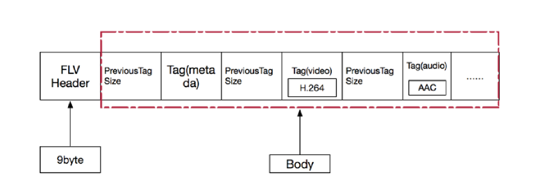
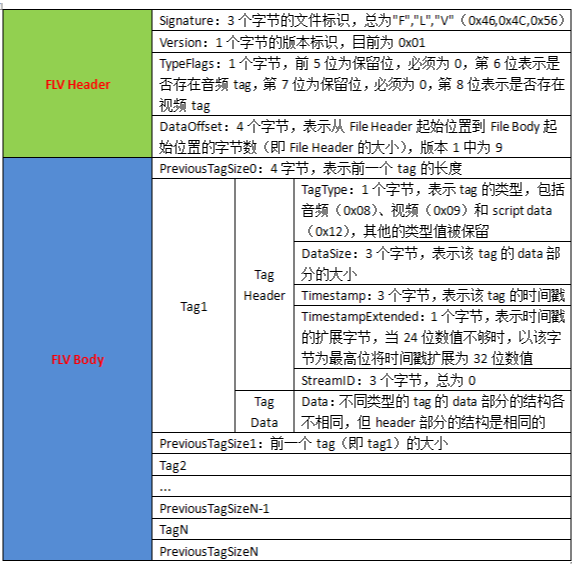
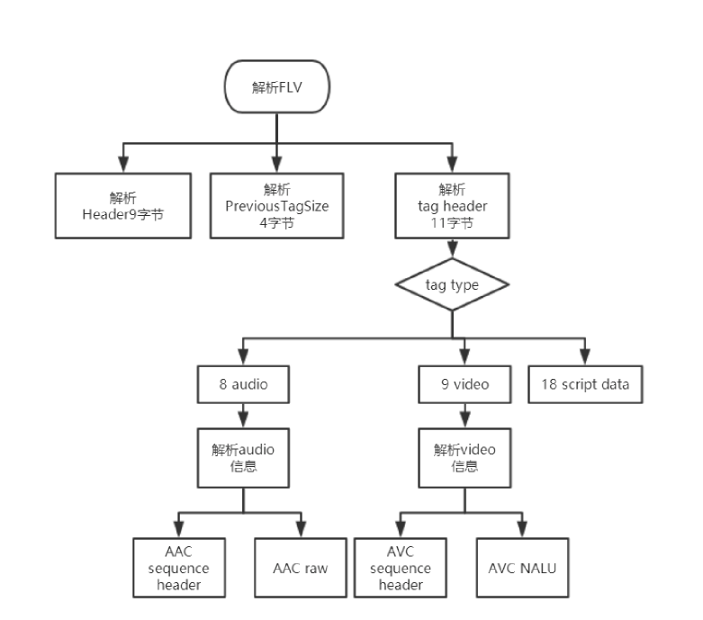
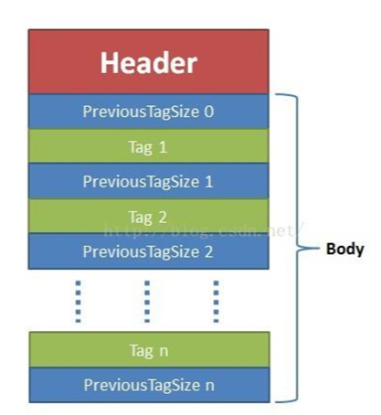

# 2.5 FLV格式分析

[FLV格式分析-FLV封装格式剖析.pdf](../PDF/FLV格式分析-FLV封装格式剖析.pdf)

# 1. flv 格式的简介

FLV（Flash Video）是一种用于传输和存储视频、音频和数据的容器文件格式。它最初由 Macromedia 开发，后来被 Adobe 收购并广泛用于 Adobe Flash Player 和 Adobe AIR 中。FLV 格式因其高效的流媒体传输能力而广受欢迎，特别是在早期的在线视频网站中，如 YouTube。

flv 文件分为两块内容：一个是 header，一个是 body

比如我们在使用摄像头存储数据的时候，接收到的数据不可能都存储在一个文件里面，需要分块存储，如果我们使用 flv 进行分块存储的时候，每一块内容都需要写入 header 和 flv 的其他数据。

# 1.1. FLV 格式的特点

容器格式：FLV 是一种容器格式，可以包含多种类型的编码视频和音频流。

视频编码：通常使用 H.263、VP6 或 H.264 编码。

音频编码：通常使用 MP3、AAC 或 Nellymoser 编码。

流媒体支持：FLV 格式支持流媒体传输，适合网络视频播放。

文件扩展名：通常为 `.flv`。

# 1.2. FLV 文件结构

FLV 文件由以下几个部分组成：

文件头（Header）：包含文件格式版本和其他基本信息。

元数据（Metadata）：包含视频和音频流的描述信息，如时长、宽高、编码格式等。

数据包（Tag）：包含实际的音视频数据，每个数据包都有一个类型标识（视频、音频或脚本数据）。

一个标准的 FLV 格式文件的结构

flv 文件的详细结构如下：

# 1.3. 大体的解析结构

# 2. flv 的 header

flv 的 header 结构如下：

| **field** | **type** | **comment** |
| --- | --- | --- |
| 签名 | UI8 | F（0x46） |
| 签名 | UI8 | L（0x4C） |
| 签名 | UI8 | V（0x56） |
| 版本 | UI8 | FLV 的版本，0x01 表示 flv 版本为 1 |
| 保留字段 | UB5 | 前五位都为 0 |
| 音频流标识 | UB1 | 是否存在音频流 |
| 保留字段 | UB1 | 为 0 |
| 视频流标识 | UB1 | 是否存在视频流 |
| 文件大小 | UI32 | FLV 版本为 1 天蝎 9，表明说 flv 头都大小，为后期的 flv 版本扩展使用。包括这四个字节，数据的起始位置就是从文件开头便宜这么多的大小 |

注释：在上面的数据 type 中，UI 表示无符号整型，后面跟的数字表示其长度是多少位。比如 UI8，表示无符号整型，长度一个字节，UI24 所三个字节，UI[8*n] 表示多个字节位。UB 表示位域，UB 表示位域，UB5 表示一个字节的 5 位，可以参考 C 中的位域结构体

FLV 头占 9 个字节，用来标识文件位 flv 类型，以及后续存储的音视频流。一个 flv 文件，每种类型的 tag 都属于一个流，也就是一个 flv 文件最多只有一个音频流，一个视频流，不存在多个独立的音视频流都在一个文件的情况。

# 3. flv body

flv header 之后，就是 flv file body，flv file body 是由一连串的 back-pointers+tags 构成的。

back-pointer 表示 Prelous Tag Size（前一个 tag 的字节数据长度），占四个字节