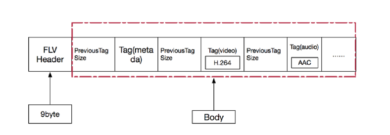

# FLV 文件格式

[FLV格式分析-FLV封装格式剖析.pdf](../PDF/FLV格式分析-FLV封装格式剖析.pdf)

## 1. FLV 文件格式 note

1. FLV（Flash Video）是一种用于传输和存储视频、音频和数据的容器文件格式。最初由Macromedia开发，后被Adobe收购，广泛用于Adobe Flash Player和Adobe AIR中。FLV格式因其高效的流媒体传输能力而广受欢迎，尤其是在早期的在线视频网站中。
2. FLV封装格式是由一个文件头和文件体组成，其中，FLV body是由一对对的（Previous Tag Size字段+tag）组成。Previous Tag Size 字段排列在Tag之前，占用4个字节。Previous Tag Size记录了前面一个Tag的大小，用于逆向读取处理。FLV header后的第一个Pervious Tag Size的值为0。
3. flv文件解析：flv文件首先分为文件头，元数据和数据包，文件头在每个完整的flv文件中只有一个，元数据在每个flv文件中只有一个，数据包可以有多个，数据包中包含音频，视频和脚本数据。
4. 文件头：文件头包含文件格式版本和其他基本信息。
5. 元数据：元数据包含视频和音频流的描述信息，如时长，宽高，编码格式等。
6. 数据包：数据包包含实际的音视频数据，每个数据包都有一个类型标识（视频，音频或脚本数据）。
7. Tag一般可以分为3种类型：脚本（帧）数据类型，音频数据类型，视频数据。FLV 数据以大端序进行存储，在解析时需要注意。一个标准的FLV文件结构如下：

## 2. FLV 文件格式 详细分析

FLV文件的详细结构如下：

1. FLV头占9个字节，用来标识文件为FLV类型，以及后续存储的音视频流。一个FLV文件，每种类型的tag都属于一个流，也就是一个FLV文件最多只有一个音频流，一个视频流，不存在多个独立的音视频流在一个文件的情况。

FLV 头大结构如下：

| 字段     | 类型          | 说明                   |
|----------|---------------|------------------------|
| 签名     | 无符号8位整型 | ‘F’ (0x46)             |
| 签名     | 无符号8位整型 | ‘L’ (0x4C)             |
| 签名     | 无符号8位整型 | ‘V’ (0x56)             |
| 版本     | 无符号8位整型 | 版本号 (通常为0x01)    |
| 保留位   | 5位           | 必须为0                |
| 音频标志 | 1位           | 1表示有音频标签        |
| 保留位   | 1位           | 必须为0                |
| 视频标志 | 1位           | 1表示有视频标签        |
| 数据偏移 | 无符号32位整型 | FLV数据的起始偏移量   |

2. FLV body ：flv header后就是flv file body ，body是由一连串的back-pointers + tags构成
3. back-pointer 表示Previous tag size (前一个tag的字节数据长度)，占用4个字节

4. flv tag：每一个tag也是由两部分组成：tag header 和 tag data，tag header里存放的是当前tag的类型，数据区（tag data）的长度等信息
5. tag header 一般占11个字节的内存空间，FLV tag结构如下：
| 字段            | 类型              | 说明                           |
|-----------------|-------------------|--------------------------------|
| Tag 类型        | 无符号8位整型     | 0x08 = audio, 0x09 = video, 0x12 = script |
| 数据大小        | 无符号24位整型    | 当前Tag数据区的大小            |
| 时间戳          | 无符号24位整型    | 当前Tag的时间戳                |
| 时间戳扩展      | 无符号8位整型     | 时间戳扩展位                   |
| Stream ID       | 无符号24位整型    | 总是0                          |

6. tag data部分包含实际的音视频数据或脚本数据，根据tag类型的不同，数据格式也不同。
7. flv文件中的timestamp和timestampExtended拼出来的是dts，也就是解码时间，时间的单位为ms，（如果不存在B帧，当然dts等于pts）
8. compositionTime表示PTS相对于DTS的偏移值，在每个视频tag的第14～16字节。显示时间（PTS）= 解码时间（tag）的第5～8字节+compositionTime，时间单位也是ms
9. script data脚本数据就是描述视频或音频的信息的数据，比如宽度，高度，时间等等，一个文件当中通常只有一个元数据，音频tag和视频tag就是音视频信息，采样，声道，频率等信息
10. script tag data 结构（脚本类型，帧类型）：该类型tag又被称为metadata tag，存放一些关于flv视频和音频的元信息，比如：duration，width，geight等，通常该类型tag会作为flv文件等第一个tag，并且只有一个，跟在file header后，该类型tag data等结构如下所示：

11. 第一个AMF包：第一个字节表示AMF包类型，一般总是0X02，表示字符串。第2-3个字节为无符号16类型值，标识字符串的长度，一般总是0X000A（onMetaData 长度）。后面字节为具体的字符串，一般总为onMataData
12. 第二个AMF包：第一个字节表示AMF包类型，一般总是0X08，表示数组。第2～5个字节为无符号32位类型，表示数组元素的个数，后面即为各数组的封装，数组元素为元素名称和值组成的对。常见的数组元素如下表所示：

| 元素名称       | 类型   | 说明                     |
|----------------|--------|--------------------------|
| duration       | Number | 视频时长（秒）           |
| width          | Number | 视频宽度（像素）         |
| height         | Number | 视频高度（像素）         |
| videodatarate  | Number | 视频数据速率（kbps）     |
| framerate      | Number | 视频帧率（fps）          |
| videocodecid   | Number | 视频编码器ID             |
| audiodatarate  | Number | 音频数据速率（kbps）     |
| audiosamplerate| Number | 音频采样率（Hz）         |
| audiochannels  | Number | 音频声道数               |
| audiocodecid   | Number | 音频编码器ID             |
| filesize       | Number | 文件大小（字节）         |

13. Audio Tag Data 结构（音频类型）：第一个字节包含了音频数据的参数信息。第二个字节开始为音频流数据（这两个字节属于tag的data部分，不是header部分）
14. 第一个字节为音频的信息，格式如下
| 位      | 描述                          |
|---------|-------------------------------|
| 0-3     | 音频编码格式 (SoundFormat)    |
| 4-5     | 采样率 (SoundRate)            |
| 6       | 采样精度 (SoundSize)          |
| 7       | 声道类型 (SoundType)          |

- **SoundFormat**: 音频编码格式
    - 0 = Linear PCM, platform endian
    - 1 = ADPCM
    - 2 = MP3
    - 3 = Linear PCM, little endian
    - 4 = Nellymoser 16 kHz mono
    - 5 = Nellymoser 8 kHz mono
    - 6 = Nellymoser
    - 7 = G.711 A-law logarithmic PCM
    - 8 = G.711 mu-law logarithmic PCM
    - 9 = reserved
    - 10 = AAC
    - 11 = Speex
    - 14 = MP3 8 kHz
    - 15 = Device-specific sound

- **SoundRate**: 采样率
    - 0 = 5.5 kHz
    - 1 = 11 kHz
    - 2 = 22 kHz
    - 3 = 44 kHz

- **SoundSize**: 采样精度
    - 0 = 8-bit
    - 1 = 16-bit

- **SoundType**: 声道类型
    - 0 = Mono
    - 1 = Stereo

15. 第二个字节开始为音频数据，需要判断该数据是正真的音频数据，还是音频config信息

| 位   | 描述                           |
|------|--------------------------------|
| 0    | AAC packet type                |

- **AAC packet type**: AAC包类型
    - 0 = AAC sequence header
    - 1 = AAC raw

16. video tag data结构（视频类型）：第一个字节包含视频数据的参数信息，第二个字节开始为视频流数据

| 位      | 描述                          |
|---------|-------------------------------|
| 0-3     | 帧类型 (FrameType)            |
| 4-7     | 编码格式 (CodecID)            |

- **FrameType**: 帧类型
    - 1 = key frame (for AVC, a seekable frame)
    - 2 = inter frame (for AVC, a non-seekable frame)
    - 3 = disposable inter frame (H.263 only)
    - 4 = generated key frame (reserved for server use only)
    - 5 = video info/command frame

- **CodecID**: 编码格式
    - 2 = Sorenson H.263
    - 3 = Screen video
    - 4 = On2 VP6
    - 5 = On2 VP6 with alpha channel
    - 6 = Screen video version 2
    - 7 = AVC

| 位   | 描述                           |
|------|--------------------------------|
| 0    | AVC packet type                |

- **AVC packet type**: AVC包类型
    - 0 = AVC sequence header
    - 1 = AVC NALU
    - 2 = AVC end of sequence