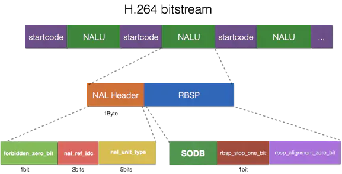
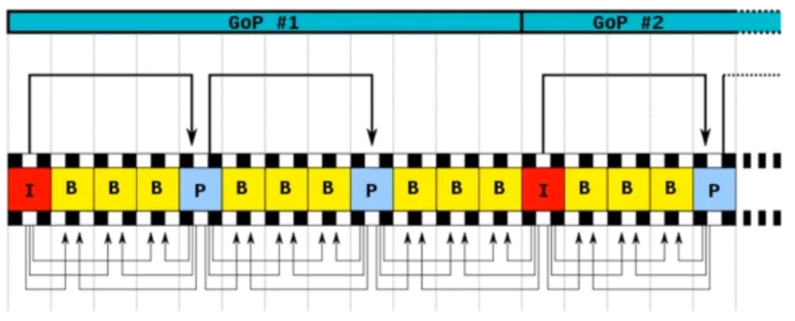
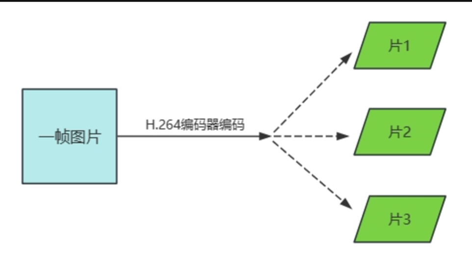
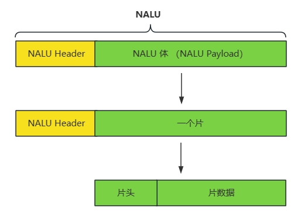
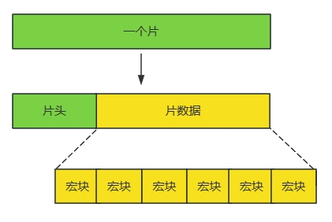
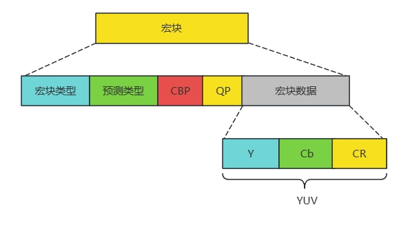
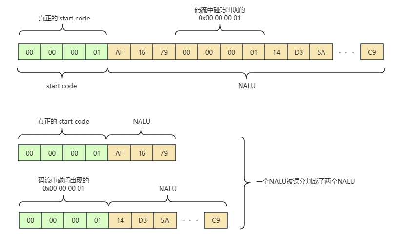

# H264编码格式分析

## 1. H264 编码 note

1. H.264，是一种视频压缩编码标准 ，同时也是MPEG-4第10部分规范(ISO/IEC 14496-10)，MPEG-4 Part 10，⼜叫Advanced Video Codec（高级视频编码），因此H.264常常称为MPEG-4 AVC或直接叫AVC。所以在H.264的参数中可以看到 AVC == H264，而 HECV == H265。H.264已经成为高精度视频录制、压缩和发布的最常用格式之一。常见的写法H264，标准写法应该是H.264。
2. H.264/AVC 协议的目的是为了创建一个更佳的视频压缩标准，在更低的比特率的情况下依然能够提供良好视频质量的标准（如，一半或者更少于MPEG-2,H.263,或者MPEG-4 Part2 ）。同时，还要不会太大的增加设计的复杂性。H.264的另外一个目标是提供足够的灵活性，以允许该标准能够应用于各种各样的网络和系统的各应用上，包括低和高比特率，低和高分辨率视频，广播，DVD存储，RTP / IP分组网络和ITU-T多媒体电话系统。
3. H.264码流是指按照H.264标准编码的视频数据流。H.264码流只存放了原始的视频数据，而不包含其他信息。例如，我们通常说的视频要包含音频，而H.264码流里就没有。除了音频之外，我们通常说的视频里还存放着其他辅助信息，比如视频的播放时长，每一帧的播放时间、帧率、画面是否旋转等等很多信息，而H.264码流里也没有。所以严格来说，H.264码流和我们通常意义上的“视频”还是有一定差距的。
4. H.264原始码流(裸流)是由⼀个接⼀个NALU组成，它的功能分为两层，VCL(视频编码层)和NAL(⽹络提取层)
5. 视频编码层（Video Coding Layer）：主要负责处理视频帧及其内部结构，包括：子块->宏块->片->帧->GOP，
6. 网络抽象层（Network Abstraction Layer）：负责将编码后的VCL数据封装成适合网络传输的格式。管理NALU（网络抽象层单元）的生成和处理。
   + 但是nalu里面并不是包含一个完整的GOP，一个nalu里面包含的是片的数据，多个片才能组成帧
   + 意思是每个nalu的功能都是不一样的
   + 我们判断一个视频是不是h264编码，可以查看里面是否含有nalu，因为nalu是h264的基本单元!

## 2. 网络抽象层（Network Abstraction Layer）

1. 网络抽象层负责将视频编码层产生的比特流组织成适合传输和存储的格式。它的主要任务是将编码数据打包成网络抽象层单元（Network Abstraction Layer Unit，NALU），这些单元可以在不同的网络和存储介质上进行传输和存储。简单的说，视频编码层将原始视频数据压缩编码，网络抽象层将压缩编码后的数据打包成NALU（网络抽象层单元）来进行传输或存储。
2. 负责将VCL产⽣的⽐特字符串适配到各种各样的⽹络和多元环境中，覆盖了所有⽚级以上的语法级别
3. 在 H.264 编码中，SPS（Sequence Parameter Set）和 PPS（Picture Parameter Set）是非常重要的参数集，它们包含了视频流的全局和局部参数信息。SPS 和 PPS 通常在视频流的开头发送，并且在解码过程中需要用到。
4. sps 和 pps 主要用于给 h264 编码传输数据，跟 gop（数据包）的关系不大
5. NALU（Network Abstraction Layer Unit）是 H.264 和 H.265（HEVC）视频编码标准中特有的概念。如果你在视频流中找到 NALU 这个模块，基本上可以确定该视频流是使用 H.264 或 H.265 编码的。
6. 在 VCL 进行数据传输或存储之前，这些编码的数据，被映射或封装进 NAL 单元
7. 在发送I帧之前，至少要发送一次SPS和PPS。
8. SPS又称为序列参数集。对应的是针对一段连续编码视频序列的参数，包含帧数，POC的约束，参考帧数目，解码图像尺寸和帧场编码模式选择等信息
9. PPS又称为图像参数集，对应的是一个序列中某一副图像或者某几副图像的参数。包含熵编码模式选择标识，片组数目，初始量化参数和去方块滤波系统调整等标识信息
10. SPS，PPS的内容都是编码器写入的，解码时，解码器一开始要收到SPS，PPS来做初始化，如果H264码流中没有SPS或PPS的话，解码器是无法解析码流数据，自然是无法播放

### NALU

1. 在 H.264 编码中，NALU（Network Abstraction Layer Unit，网络抽象层单元）是视频数据的基本单元。每个 NALU 包含一个 NAL 头和一个 RBSP（Raw Byte Sequence Payload，原始字节序列负载）。I 帧、P 帧和 B 帧都由多个 NALU 组成，但它们之间的 NALU 有一些区别。
2. nalu 里面存储的是视频的片
3. NALU的作用：NALU的最核心的用处就是起到一个承上启下的作用。我们知道，在通常情况下，H.264 码流只存放了原始的画面信息，而不包含其他信息，所以严格来说，H.264 码流和我们通常意义上的“视频”还是有一定差距的。比如，我们通常说的视频要包含音频，H.264 码流里就没有。除了音频之外，我们还需要存放其他辅助信息，比如视频的播放时长，每一帧的播放时间，帧率，画面是否旋转，等等非常多的信息。所以我们日常使用过程中，往往是把 H.264 码流插入到其他视频容器内，比如 mp4，flv等。而 NALU 的作用，就是很好的把 H.264 码流和上层的封装容器进行有效得分割，使得两者可以相互不干扰，相互独立。
4. NALU的主体涉及到三个重要的名词，分别为EBSP、RBSP和SODB。其中EBSP完全等价于NALU主体，而且它们三个的结构关系为：EBSP包含RBSP，RBSP包含SODB
5. 在 H.264 的文档中，并没有 EBSP 这一名词出现，但是在 H.264 的官方参考软件 JM 里，却使用了 EBSP。NALU 的组成部分为：NALU = NALU Header + RBSP，其实严格来说，这个等式是不成立的，因为RBSP并不等于NALU刨去NALU Header。严格来说，NALU的组成部分应为：NALU = NALU Header + EBSP。
6. RBSP（Raw Byte Sequence Payload，原始字节序列载荷）RBSP 是 H.264 标准中的概念，要说 RBSP，我们就要提到一个我们之前提到的概念，防竞争字节 （Emulation Prevention Bytes）。EBSP 相较于 RBSP，多了防竞争字节：0x03。
7. 我们知道， H.264 在编码的时候，会加上 0x03 的字节来防止和 start code 产生冲突。而在读取到 NALU 之后，我们就要把编码时候加上的防竞争字节去掉。NALU 去掉 NALU Header 就是 EBSP，接着再去掉防竞争字节之后的数据，就叫做 RBSP。
8. SODB（String of Data Bits，数据比特串）SODB是一种以比特为单位的数据表示形式。RBSP 相较于 SOBP，多了tariling bits。一个SODB可以包含任意数量的比特，通常用于表示二进制数据流。视频在编码的时候，会将一比特一比特的数据写入到码流里面，而在写完之后，就有可能发生一种情况，就是写入的数据数量不满一个字节。
9. NALU、EBSP、RBSP和SODB的关系:
   + NALU - NALU Header = EBSP
   + EBSP - 防竞争字节 = RBSP
   + RBSP - 补齐的数据 = SODB

10. 在 H.264 编码中，NALU（Network Abstraction Layer Unit，网络抽象层单元）的头部信息非常重要，它包含了描述 NALU 类型和其他相关信息的字段。NALU 头部通常是一个字节（8 位）
   + T nal_unit_type 为负荷数据类型，占5bit：这个NALU单元的类型，1-12由H264使用，24-31由h264以外的应用使用
   + R 为重要性指示位，占2bit取00~11,似乎指示这个NALU的重要性,如00的NALU解码器可以丢弃它⽽不影响图像的回放,0～3，取值越⼤，表示当前NAL越重要，需要优先受到保护。如果当前NAL是属于参考帧的⽚，或是序列参数集，或是图像参数集这些重要的单位时，本句法元素必需⼤于0。
   + F 为禁止位，占1bit，在h264规范中规定了这一位必须位0
11. nal_unit_type 字段决定了 NALU 的类型，不同类型的 NALU 包含不同的 RBSP 语法结构。 常见的 NALU 类型如下：
   + 1：非 IDR 图像的片（Slice of a non-IDR picture）
   + 5：IDR 图像的片（Slice of an IDR picture）
   + 6：补充增强信息（Supplemental enhancement information, SEI）
   + 7：序列参数集（Sequence parameter set, SPS）
   + 8：图像参数集（Picture parameter set, PPS）
   + 9：分隔符（Access unit delimiter）
12. 在大多数的情况下，NALU在网络发送时，会封装成RTP格式，有两种方式
    + 单包模式：rtp payload 仅由一个完整的NALU组成，这种情况下一般用于H264 NALU大小 小于MTU（最大传输单元），SPS，PPS采用单包模式发送
    + 分包模式：当H264 NALU的长度超过MTU时，就必须对NALU进行分片封包

## 3. 视频编码层（Video Coding Layer）

1. 视频编码层（VCL）包括核心压缩引擎和块、宏块、片的语法级别定义，负责将原始视频数据进行编码，尽可能独立于网络进行高效的压缩，并使用多种编码工具和技术来实现数据的压缩。
2. 我们知道视频的本质是连续的图片，比如电影就是一秒 24 张图片，我们对原始的数据进行编码的概念的意思是连续的图片其实并不需要每一张都是原始的完整的图片，有些图片完全可以压缩处理，这个就是编码的概念
3. 多个编码组成的包，就叫做数据包，我们在 h264 编码当中就称之为组（GOP）片，宏块这些一起组成了 h264 的码流分层结构；
4. 在视频编码层这里，分别是GOP，帧，片，宏块，子块

### GOP（Group of Pictures）

1. GOP（图像组）主要用于形容一个 IDR 帧到下一个 IDR 帧之间的间隔了多少个帧
2. 在视频编码序列中，GOP 指两个 I 帧之间的距离，Reference（参考周期）指两个 P 帧之间的距离，一个 I 帧所占用的字节数大于一个 p 帧，一个 P 帧所占用的字节数大于一个 B 帧
3. 所以帧码率不变的情况下，GOP 值越大，P，B 帧的数量会越多，平均每个 I，P，B 帧所占用的字节数就越多，也就容易获得较好的图像质量，Reference 越大，B 帧的数量越多，同理也更容易获得较好的图像质量。
4. 需要说明的情况是，通过提高 GOP 值来提高图像质量是有限度的，在遇到场景切换的情况下，h264 编码器会自动的强制插入一个 I 帧，此时实际的 GOP 值被缩短了。另一方面，在一个 GOP 中，P，B 帧是由 I 帧预测得到的，当 I 帧的图像质量比较差的时候，会影响到一个 GOP 中后续 P，B 帧的图像质量，直到下一个 GOP 开始才有可能得到恢复，所以 GOP 帧也不能设置过大
5. 同时，由于 P 帧，B 帧的复杂度大于 I 帧，所以过多的 P，B 帧会影响编码效率，使编码效率过低，另外，过长的 GOP 还会影响到 seek 操作的响应速度，由于 P，B 帧是由前面的 I 或 P 帧预测得到的，所以 seek 操作需要直接定位，解码某一个 P 或 B 帧时，需要先解码得到本地的 GOP 内的 I 帧及之前的 N 个预测才可以，GOP 值越长，需要解码的帧预测越多，seek 响应的时间也越长
6. 一个序列的第一个图像叫做 IDR 图像（立即刷新图像），IDR 都是 I 帧图像
7. I 和 IDR 帧都是使用帧内预测，I帧不用参考任何帧，但是之后的P帧和B站是有可能参考这个I帧之前的帧的，IDR就不允许这样
8. IDR 图像：IDR 图像是一个特殊的 I 帧，w它不仅独立编码（不依赖于其他帧），而且在它之后的所有帧都不能引用它之前的任何帧。这意味着在 IDR 图像之后，解码器可以完全刷新并重新开始解码，而不需要依赖之前的任何帧。IDR 图像的作用
   + 随机访问：IDR 图像允许解码器在视频流中快速跳转到新的位置进行解码。
   + 错误恢复：IDR 图像帮助解码器从传输错误或数据丢失中恢复，避免错误传播。
   + GOP 结构：IDR 图像通常作为一个新的 GOP 的起始点，确保新的场景或时间点从一个干净的状态开始解码。
9. 假设一个视频流的 GOP 结构为 IBBPBBPBBPBB，其中 I 是 IDR 图像：
   + IDR 图像：第一个帧是 IDR 图像，独立编码，不依赖于之前的任何帧。
   + B 帧和 P 帧：IDR 图像后面跟随若干个 B 帧和 P 帧，这些帧可以引用 IDR 图像及其之后的帧，但不能引用 IDR 图像之前的任何帧。
10. 其核心作用是，为了解码的重同步，当解码器解码到IDR图像时，立即将参考帧队列清空，将已解码到数据全部输出或抛弃，重新查找参数集，开始一个新的序列（GOP）。这样如果前一个序列出现重大错误，在这里可以获得重新同步的机会，IDR图像之后的图像永远不会使用IDR之前的图像的数据来解码

### 帧（Frame）

1. 帧（Frame）：一个帧可以包含多个 NALU。
2. H264 编码当中的 I 帧，B 帧，P 帧
3. 压缩率 B > P > I

4. I帧：帧内编码帧，意义：I帧通常是每个GOP（MPEG使用的一种视频压缩技术）的第一帧，经过适度的压缩，作为随机访问的参考点，可以当成图像，I帧可以看成是一个图像经过压缩后的产物，自身可以通过视频解压算法解压成一张单独的完整的图片
   + 它是一个全帧压缩编码帧，它将全帧图像信息进行JPEG压缩编码以及传输
   + 解码时仅用i帧就可以重构完整图像
   + I帧描述两图像背景和运动主体的详情
   + I帧不需要参考其他画面而生成
   + I帧是P帧和B帧的参考帧（其质量直接影响到同组中以后各帧的质量）
   + I帧是帧组成GOP的基础帧（如果IDR为第一帧），在一组中只有一个IDR帧，一个或多个I帧（包括IDR帧）
   + I帧不需要考虑运动矢量
   + I帧所占数据的信息量比较大
5. P帧：前向预测编码帧，通过充分的将低于图像序列中前面已编码帧的时间冗余信息来压缩传输数据量大编码图像，也叫做预测帧，需要参考其前面的一个I帧或P帧来生成一张完整的图片
   + P帧是I帧后面相隔1-2帧的编码帧
   + P帧采用运动补偿的方法传送它与前面的I或P帧的差值以及运动矢量（预测误差）
   + 解码时必须将I帧中的预测值与预测误差求和后才能重构完整的P帧图像
   + P帧属于前向预测的帧间编码，它只参考前面最靠近它的I帧或P帧
   + P帧可以是其后面P帧的参考帧，也可以是其前后的B帧的参考帧
   + 由于P帧数参考帧，它可能造成错误解码错误的扩散
   + 由于是差值传送，P帧的压缩比较高
6. B帧：双向预测帧，即考虑与源图像序列前面已编码帧，也顾及源图像序列后面已编码帧之间的时间冗余信息来压缩传输数据量大编码图像，也叫双向预测帧，则要参考其前一个I或P帧及其后面的一个p帧来生成一张完整的图片，要解码B帧，不仅要取得之前的缓存画面，还要解码之后的画面，通过前后画面的与本帧数据的叠加取得最终的画面，B帧压缩率高，但是解码时CPU会比较累。
    B帧以前面的I或P帧和后面的P帧为参考帧，找出B帧某点的预测值和两个运动矢量，并取得预测差值和运动矢量传送，接收端根据运动矢量帧两个参考帧中找出预测值并与差值求和，得到B帧某点样值，从而可以得到完整的B帧
    + B帧是有前面的I或P帧和后面的P帧来进行预测的
    + B帧传送的是它与前面的I或P帧和后面的P帧之间的预测误差以及运动矢量
    + B帧是双向预测编码帧
    + B帧压缩比最高，因为它只反应两参考帧间运动主体的变化情况，预测比较准确
    + B帧不是参考帧，不会造成解码错误的扩散

### 片（Slice）

1. 片（Slice）定义：片是图像的一部分，可以独立解码。一个图像可以被划分为多个片，每个片包含若干个宏块。类型：I 片（Intra-coded Slice）：只使用片内预测，不依赖其他片。P 片（Predictive-coded Slice）：使用前面的片进行预测。B 片（Bi-predictive-coded Slice）：使用前面和后面的片进行双向预测。功能：片的划分可以提高解码的并行性和错误恢复能力。
2. 片（Slice）：一个片通常对应一个 NALU，片的编码数据被封装在 NALU 的 RBSP 中。
3. 片是 H.264 提出的新概念，实际的原始视频图像数据保存在NALU的 VCL 层级中，这部分数据在码流中被称作是片（slice）。
4. 片（slice）的概念不同与帧（frame），帧（frame）是用作描述一张图片的，一帧（frame）对应一张图片，而片（slice）是通过编码图片后切分图片通过高效的方式整合出来的概念。
   + 一个 slice 包含一帧图像的部分或全部数据，换言之，一帧视频图像可以编码为一个或若干个 slice。在不同的编码实现中，同一帧图像中所构成的 slice 数目不一定相同。
   + 一个 slice 编码之后被打包进一个 NALU，所以一个NALU包含一个slice。
   + 一帧图片经过 H.264 编码器之后，就被编码为一个或多个片（slice）。这属于编码阶段,由VCL实现。

5. 而装载着这些片（slice）的载体，就是 NALU 了，我们可以来看看 NALU 跟片的关系（slice）。这部分由NAL实现。

6. 上图中可以看出，片（slice）都是由 NALU 装载并进行网络传输的，但是这并不代表 NALU 内就一定是切片，这是充分不必要条件，因为 NALU 还有可能装载着其他用作描述视频的信息，比如前面提到的SPS、PPS。
7. 片的主要作用是用作宏块（Macroblock）的载体。一个 slice 最少包含一个宏块，最多包含整帧图像的宏块。我们可以理解为一帧图像可以编码为一个或多个片(Slice)，而每一个片(Slice)最少包含一个宏块，最多包含整帧图像的宏块。
8. 片的主要目的是为限制误码的扩散和传输。如何限制误码的扩散和传输呢？每个片（slice）都应该是互相独立被传输的，某片的预测（片内预测和片间预测）不能以其它片中的宏块（Macroblock）为参考图像。
9. 每个片也包含头和数据两部分：
    + 片头中包含着片类型、片中的宏块类型、片帧的数量、片属于哪个图像以及对应的帧的设置和参数等信息。
    + 片数据中则是宏块，这里就是我们要找的存储像素数据的地方。

### 宏块（Macroblock）

1. 宏块（Macroblock）定义：宏块是片的基本编码单元，通常是 16x16 像素的区域。组成：亮度（Luma）宏块：16x16 像素。色度（Chroma）宏块：对于 4:2:0 采样，每个色度分量是 8x8 像素。功能：宏块可以进一步划分为更小的块，用于更精细的编码和预测。
2. 宏块（Macroblock）：片由多个宏块组成，宏块的编码数据也是片的一部分。
3. 宏块是视频信息的主要承载者，因为它包含着每一个像素的亮度和色度信息。视频解码最主要的工作则是提供高效的方式从码流中获得宏块中的像素阵列。
4. 组成部分：宏块由亮度元素和色度元素组成。以YUV420为例，一个宏块由一个16×16亮度像素和附加的一个8×8 Cb和一个 8×8 Cr 彩色像素块组成。
5. 每个图象中，若干宏块被排列成片的形式。
6. 从下图中，可以看到，宏块中包含了宏块类型、预测类型、Coded Block Pattern 编码的块模式、Quantization Parameter 量化参数、像素的亮度和色度数据集等等信息。

### 子块（Sub-block）

1. 块（Block）定义：块是宏块的子单元，用于更精细的预测和变换。类型：亮度块（Luma Block）：可以是 16x16、8x8、4x4 等不同大小。色度块（Chroma Block）：通常是 8x8 或 4x4。功能：块用于帧内预测（Intra Prediction）和帧间预测（Inter Prediction），以及变换和量化。关系图像（Frame）：由多个片组成。片（Slice）：由多个宏块组成。宏块（Macroblock）：由多个块组成。块（Block）：是宏块的子单元，用于具体的预测和编码操作。
2. 子块（Sub-block）：宏块可以进一步划分为子块，子块的编码数据包含在宏块中。

## 3. H264 码流组织方式

1. 多个NALU在网络中传输或者写到一个文件里的时候，多个NALU首位相连成一串，因为NALU本身长度不一，也没有具体的标识符用来表明自己是一个独立的NALU，那么我们在从网络上接收到数据或者读取这个文件的时候，其实没有办法将在一起的NALU有效的进行区分。为了解决这个问题，我们必须在H264码流中将NALU进行分割，以便将在一起的NALU有效的进行区分，这种分割的方式就是H.264码流的组织方式。目前H264主流的码流组织方式有两种：AnnexB和AVCC两种格式。
2. 对于annexB和avcC这两种格式，不同的厂商支持程度也不太一样，例如，Android硬解码MediaCodec 只接受annexB格式的数据，而Apple的VideoToolBox，只支持avcC的格式。
3. annex b 和 avcc的区别
   + NALU的分割方式不同：annxB格式使用start code 进行分割，start code 为0x000001。avcc格式使用NALU长度（固定字节，字节数由extradata中的信息给定）进行分割
   + sps/pps的数据结构不同：annex B格式中，sps/pps存放帧NALU中，以start code作为分隔符，这种格式下SPS/PPS通常放在关键帧之前。avcc格式中，SPS/ PPS存放在extrdata中，不是放在NALU中，这种格式下SPS/PPS的存放位置和帧数据无关
   + 适用场景不同：annexB格式通常用于实时的流格式，avcC格式的一个优点是在开始配置解码器的时候可以跳到流的中间播放，这种格式通常用于可以被随机访问的多媒体数据

### Annex B 格式

1. 但是只在 NALU 前面加上起始码还是会产生问题的，因为原始码流中，是有可能出现 0x00 00 00 01 或者 0x00 00 01 的，这样就会导致读取程序将一个 NALU 误分割成多个 NALU。为了防止这种情况发生，AnnexB 引入了防竞争字节（Emulation Prevention Bytes）的概念。

2. AnnexB格式使用起始码（start code）作为NALU的分隔符。
3. AnnexB格式通常用于实时的流格式，比如说传输流、实时播放、通过无线传输的广播、DVD等。在这些格式中通常会周期性的重复SPS和PPS包，经常是在每一个关键帧之前。因此据此建立解码器可以一个随机访问的点，这样就可以加入一个正在进行的流，及播放一个已经在传输的流。
4. annexB格式也叫MPEG-2 transport stream format格式（ts格式），ElementaryStream格式。用于ts流中（以及使用ts作为切片的hls格式中即".ts"文件中）。  

### AVCC 格式（也称为 MP4 格式）

1. AnnexB 的原理是在每个 NALU 前面写上一个特殊的起始码，通过这个起始码来当做 NALU 的分隔符，从而分割每个 NALU。而 avcC 则采用了另外一种方式，那就是每一个NALU包都加上了一个指定NALU长度的前缀，前缀这几个字节（大端字节序）转成一个整数表示整个 NALU 的长度，我们不妨把这个前缀叫做 NALU Length。指定前缀字节数的值保存在一个头部对象中(流开始的部分)，这个头通常称为 extradata 或者 sequence header。
2. 在读取的时候，先把这个extradata读出来，解析得到NALU Length的字节数，NALU Length这几个字节转成一个整数即为NALU Length的值，然后按照长度值读取整个 NALU。
3. avcC格式也叫AVC1格式，MPEG-4格式，字节对齐，因此也叫Byte-Stream Format。用于mp4、flv、mkv等封装中。
4. AVCC格式在每个NALU之前包含了长度信息，可以直接根据长度信息来定位和提取NALU。
5. AVCC格式也叫AVC1格式，MPEG-4格式，常用于mp4/flv等封装中。AVCC格式的一个优点是在开始配置解码器的时候可以跳到流的中间播放，这种格式通常用于可以被随机访问的多媒体数据，如存储在硬盘的文件。解码器配置参数在一开始就配置好了，系统可以很容易的识别NALU的边界，不需要额外的起始码，减少了资源的浪费，同时可以在播放时调到视频的中间位置。这种格式通常被用于可以被随机访问的多媒体数据，如存储在硬盘的文件。MP4、MKV通常用AVCC格式来存储。
6. extradata (或sequence header) 中包含NULA长度的字节数以及SPS/PPS信息，基本格式如下

字段       | 类型   | 解释
-----------|--------|-------------------------
version    | 8bit   | 总是等于 0x01
profile    | 8bit   | 表示配置文件级别
compatibility | 8bit | 表示兼容性
level      | 8bit   | 表示级别
reserved   | 6bit   | 保留位，总是等于 111111
nal_length_size_minus_one | 2bit | NALU 长度前缀字节数减 1
reserved   | 3bit   | 保留位，总是等于 111
sps_count  | 5bit   | SPS 的数量
sps_length | 16bit  | SPS 数据的长度
sps_data   | 可变   | 实际的 SPS 数据
pps_count  | 8bit   | PPS 的数量
pps_length | 16bit  | PPS 数据的长度
pps_data   | 可变   | 实际的 PPS 数据

## 4. h265

1. H265是继H264之后所制定的新的视频编码标准，h265标准围绕现有的h264保留原来的某些技术，同时对现有的技术改进
2. 新技术使用先进的技术用以改善码流，编码质量，延时和算法复杂度之间的关系达到最优化设置