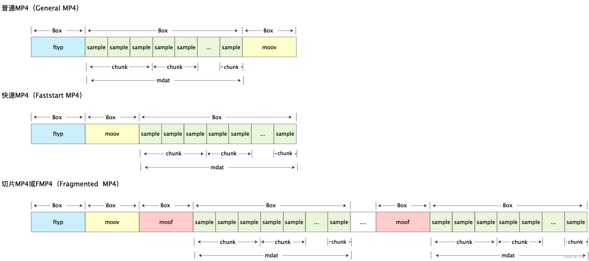
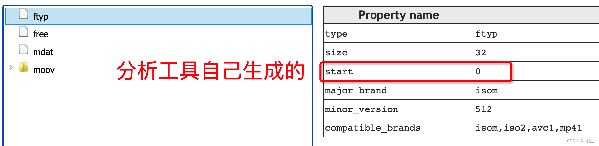
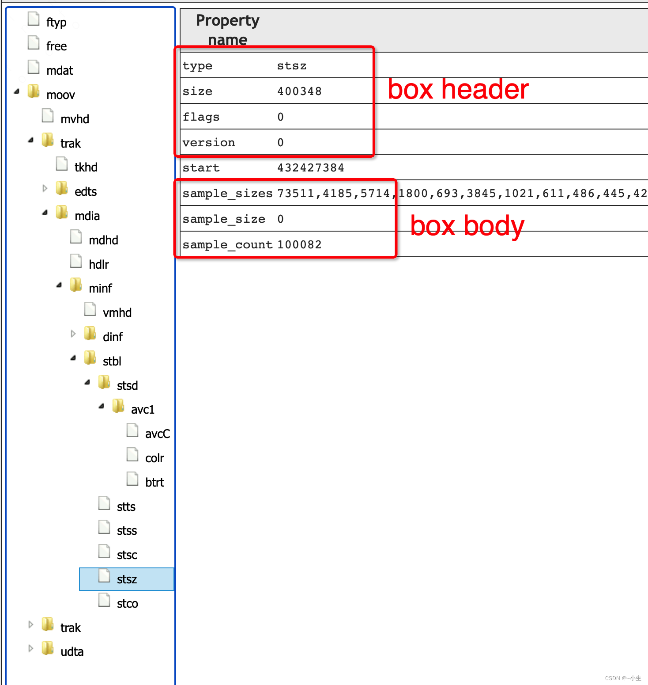

# MP4 文件格式分析

## 1. MP4 文件格式 note

1. MP4（MPEG-4  Part 14）是一种常见的多媒体容器格式，用于存储视频、音频、字幕和其他数据。它是MPEG-4标准的一部分，由国际标准化组织（ISO）定义。MP4文件格式广泛应用于视频存储、流媒体传输和数字版权管理（DRM）等领域。
2. MP4是最常见的封装格式之一，因为其跨平台的特性而得到广泛应用。MP4文件的后缀为.mp4，基本上主流的播放器、浏览器都支持MP4格式。
3. MP4文件由多个box组成，每个box存储不同的信息。box类型有很多，但基本结构都是一样的，都是header和body的组合；header是对box的整体描述也就是元数据，body实际存储的内容跟box类型有关
4. MP4有三种组织方式(MP4格式解析 - 腾讯云开发者社区-腾讯云)
   + 普通MP4，General MP4，box模式为ftyp-mdat-moov。头在后面，FFMPEG默认出的就是这种，写入比较简单。读取时需要seek；所以有些浏览器会需要完全下载后才能开始播放，有些应该可以用HTTP RANGE跳过mdat读取moov。SRS录制MP4文件可以用这种模式。
   + 快速MP4，Faststart MP4，box模式为ftyp-moov-mdat。头在前面，FFMEPG需要指定参数，生成MP4后，再过一遍文件才能支持。比上面的对于某些浏览器会比较友好，但是就需要再过一遍文件。对于SRS录制成MP4文件而言，容易造成IO阻塞（等待的时间过长，导致服务线程挂起，具体看ST的实现，不可以长时间的做CPU操作或者磁盘操作）。
   + 切片MP4或FMP4，Fragmented MP4，box模式为ftyp-moov-moof-mdat，视频/音频 metadata 信息与数据都存在一个个 moof、mdat 中，它是一个流式的封装格式。分段模式，浏览器H5直接播放时，有些能播，有些不行。这种一般用在DASH中，不会直接用浏览器播放，而是通过JS解析后，给MSE播放（APPEND到Video对象的Buffer中去，具体参考MSE的文章）。FFMPEG也是需要指定参数才能生成。这种对于流媒体比较合适，SRS生成DASH可以用这种。
5. 在线分析mp4文件分析网站：https://gpac.github.io/mp4box.js/test/filereader.html
6. mp4数据流组成
   + 真正的音视频数据都在mdat这个box中，其它box都是对文件、数据流的描述
   + sample：真正的音视频数据；video sample即为一帧视频，或一组连续视频帧，audio sample即为一段连续的压缩音频，它们统称sample。
   + chunk：一个trak的连续几个sample组成的单元。
   + chunk、sample的对应关系，以及如何在mdat中找到chunk和sample可以参考stsd及其子box和第四章开始部分。

7. MP4中所有的序号都是从1开始：比如track_ID、chunk序号、sample序号都是从1开始
    MP4支持可变码率，可变帧率，通过stsc中sample_description_index的需要来决定chunk使用哪个stsd来进行编解码
8. 普通mp4用于点播场景，fmp4通常用于直播场景，fmp4 跟普通 mp4 基本文件结构是一样的。它们有以下差别
   + 普通mp4的时长、内容通常是固定的。fMP4 时长、内容通常不固定，可以边生成边播放；
   + 普通mp4完整的metadata都在moov里，需要加载完moov box后，才能对mdat中的媒体数据进行解码渲染；FMP4中，媒体数据的metadata在moof box（Movie Fragment Box）中，moof 跟 mdat （通常）结对出现。moof 中包含了sample duration、sample size等信息，因此，fMP4可以边生成边播放；
   + 怎么判断mp4文件是普通mp4，还是fMP4呢？一般可以看下是否存在存在mvex box（Movie Extends Box）。当存在mvex时，表示当前文件是fmp4（非严谨）。此时，sample相关的metadata不在moov里，需要通过解析moof box来获得。
9. 普通mp4和快速mp4的区别
   + 快速mp4的moov在前面可以边下载边播放。
   + 快速mp4的moov在前面有可以减少点播场景下的秒开时间。
10. 各数据关系图

## 1.2 MP4 解析过程

1. 这里说的解析基本是指解封装、播放的过程，都是先读取box中的内容，然后根据box中内容可以找到每一个sample也就是每一帧数据，然后进行解封装、播放。
2. 通过“2.2 Box Body”中的介绍，每个chunk有多少个类似的sample，还知道总的chunk个数，还知道每个chunk的偏移量offset，间接得出了每个chunk的大小。还知道每个sample的字节大小。通过这些信息，我们可以建立一张表，这张表可以记录每个sample的文件偏移量，从开始到结束叠加；那么我们来看如何推算每个sample的offset。假如我知道了第1个sample的offset(其实就是chunk1的offset)，我还知道第1个sample的字节大小（stsz中存放）那么第1个sample的offset就可以得出： offset1+sample_size1。以此类推我们就能建立一张表sample序号和其offset的表。
3. 详细过程如下：（《FFmpeg音视频开发基础与实战》 P103）
   + 通过stss确定关键帧的数据和每个关键帧的序号
   + 通过stts获取音视频流的总帧数、每一帧的dts和整体时长
   + 通过stsz获取每个sample的大小及整个流的总大小
   + 通过stco获取音视频流中chunk的数据和在文件中的位置（不是在mdat中的位置）
   + 通过stsc计算出流中chunk的数据和在文件中的位置，并通过chunk在文件中的位置及chunk中每个sample的大小，确定每个sample在文件中的位置和大小
   + 整理每个流的码流信息和时间戳信息，构成整体播放的时间轴，之后进行解码的渲染播放

## 1.3 MP4 知识点汇总

1. Full box 、Container box的含义“二、内容描述-> 4”
2. 比较重要的box：
   + ftyp（File Type Box）：描述文件遵从的MP4规范与版本
   + moov（Movie Box）：媒体的metadata信息，有且仅有一个
   + mdat（Media Data Box）：存放实际的媒体数据，普通mp4和快速mp4一般只有一个，fmp4一般有多个
   + trak（Track Box）：每路媒体流以一个track表示，并在track中保存该媒体流所有的配置和播放控制等信息，继续细分这些信息主要在子box的tkhd、mdia中保存。视频track包含vmhd，音频track包含smhd

3. 编解码信息保存的位置：
   + moov（Movie Box）：存储 mp4 的 metadata
   + moov的box body也是box，而且包含多个box，其中最重要的两个box是 mvhd 和 trak
   + mvhd（Movie Header Box）：mp4文件的整体信息，比如创建时间、文件时长等
   + trak（Track Box）：一个mp4可以包含一个或多个轨道（比如视频轨道、音频轨道），轨道相关的信息就在trak里。trak是container box，至少包含两个box，tkhd、mdia
   + mvhd针对整个影片，tkhd针对单个track，mdhd针对媒体，vmhd针对视频，smhd针对音频，可以认为是从 宽泛 > 具体，前者一般是从后者推导出来的

## 1.4 MP4使用场景及优缺点

1. 使用场景：主要是点播场景
2. 优点：
   + MP4的标准非常灵活，可扩展性比较好，有很多常见的格式是基于MP4做了一些扩展，然后被应用到比较广的范围，比如 CMAF、DASH、HLS。
   + 因为MP4格式的开放性和灵活性，使得使用范围非常广泛，我们日常看电视剧，录视频时，最常见的就是MP4格式了。
3. 缺点：
   + 普通mp4情况下，会导致播放延时较高：moov在文件尾，播放器需要遍历整个文件后才会找到moov并播放。

## 2. 内容描述

1. MP4文件由多个box组成，每个box存储不同的信息，且box之间是树状结构。
2. 虽然box类型有很多，但基本结构都是一样的，都是header和body的结构
3. 在最外层的BOX中主要有ftyp、moov、mdat三种类型的BOX。ftyp主要为MP4格式的标识信息，moov为这个MP4文件sample数据的metadata，用来描述sample大小，位置，dts等，mdat为sample具体数据。每个sample数据在文件中的位置，是通过moov中的trak得到的。mp4 box的解析其实就是读取各种类型box，将里面的一些数据通过file_read读取并赋值。（ffmpeg的avformat_open_input()
4. Box还有两个概念：
   + Full box：在部分box header中，存在version、flags字段，这样的box叫做Full Box：
   + Container box：当box body中嵌套其他box时，这样的box叫做container box。

### 2.1 Box Header

1. box的元数据。box header中，只有type、size是必选字段。当size==0时，存在largesize字段。在部分box header中，还存在version、flags字段，这样的box叫做Full Box；
2. box header 结构如下：

| 字段           | 注释                                                                                     |
|----------------|------------------------------------------------------------------------------------------|
| **type**       | box类型，包括“预定义类型”、“自定义扩展类型”                                              |
|                | - **预定义类型**：比如 ftyp、moov、mdat 等预定义好的类型；                                |
|                | - **自定义扩展类型**：如果 type == uuid，则表示是自定义扩展类型。size（或 largesize）随后的16字节，为自定义类型的值（extended_type）。 |
| **size**       | 包含 box header 在内的整个 box 的大小，单位是字节。当 size 为 0 或 1 时，需要特殊处理：  |
|                | - **size 等于 0**：当前 box 为文件的最后一个 box，其内容扩展到文件末尾；                  |
|                | - **size 等于 1**：box 的大小由后续的 largesize 确定。                                    |
| **largesize**  | 包含 box header 在内的整个 box 的大小                                                    |
| **extended_type** | 自定义扩展类型                                                                         |
| **version**    | 当前 box 版本，为扩展做准备                                                              |
| **flags**      | 标志位，含义由具体的 box 定义                                                            |

## 2.2 Box Body

1. box数据体，不同box包含的内容不同，需要参考具体box的定义。有的 box body 很简单，比如 ftyp。有的 box 比较复杂，可能嵌套了其他box，比如moov。当box body中嵌套其他box时，这样的box叫做container box。
2. 下面介绍下比较重要（不是全部）的box，这些box的上下级关系参考上图。
3. box的内容均由 MP4Box.js - JavaScript MP4 Reader/Fragmenter 分析出来，“start”是分析工具自己生成的，不是box中的内容

### 2.2.1 ftyp（File Type Box）

1. ftyp用来指出当前文件遵循的规范
2. 结构如下：

| 字段               | 注释                                                                                     |
|--------------------|------------------------------------------------------------------------------------------|
| **type**           | box类型，包括“预定义类型”、“自定义扩展类型”                                              |
|                    | - **预定义类型**：比如 ftyp、moov、mdat 等预定义好的类型；                                |
|                    | - **自定义扩展类型**：如果 type == uuid，则表示是自定义扩展类型。size（或 largesize）随后的16字节，为自定义类型的值（extended_type）。 |
| **size**           | 包含 box header 在内的整个 box 的大小，单位是字节。当 size 为 0 或 1 时，需要特殊处理：  |
|                    | - **size 等于 0**：当前 box 为文件的最后一个 box，其内容扩展到文件末尾；                  |
|                    | - **size 等于 1**：box 的大小由后续的 largesize 确定。                                    |
| **major_brand**    | 比如常见的 isom、mp41、mp42、avc1、qt等。它表示“最好”基于哪种格式来解析当前的文件。举例，major_brand 是 A，compatible_brands 是 A1，当解码器同时支持 A、A1 规范时，最好使用A规范来解码当前媒体文件，如果不支持A规范，但支持A1规范，那么，可以使用A1规范来解码； |
| **minor_version**  | 提供 major_brand 的说明信息，比如版本号，不得用来判断媒体文件是否符合某个标准/规范；     |
| **compatible_brands** | 文件兼容的brand列表。比如 mp41 的兼容 brand 为 isom。通过兼容列表里的 brand 规范，可以将文件 部分（或全部）解码出来； |

3. 什么是isom？
   + isom（ISO Base Media file）是在 MPEG-4 Part 12 中定义的一种基础文件格式，MP4、3gp、QT 等常见的封装格式，都是基于这种基础文件格式衍生的。
   + MP4 文件可能遵循的规范有mp41、mp42，而mp41、mp42又是基于isom衍生出来的。
   + 3gp（3PP）：一种文件格式，主要用于3G手机上
   + QT（QuickTime）：.qt文件代表苹果QuickTime媒体文件

### 2.2.2 mdat（Media Data Box）

1. box body保存了二进制的音视频数据
2. 音视频数据的编解码信息都在其它box中保存，解析的时候先读取其它box的信息获取编解码信息以及音视频包在mdat中的位置，然后再读取mdat获取音视频数据。
3. 结构如下：

### 2.2.3 moov（Movie Box）

1. Movie Box，存储 mp4 的 metadata
2. moov的box body也是box，而且包含多个box，其中最重要的两个box是 mvhd 和 trak：
   + mvhd：Movie Header Box，mp4文件的整体信息，比如创建时间、文件时长等
   + trak：Track Box，一个mp4可以包含一个或多个轨道（比如视频轨道、音频轨道），轨道相关的信息就在trak里。trak是container box，至少包含两个box，tkhd、mdia
3. moov可能位于文件头部或尾部。位于文件尾部的moov更适用于视频文件编码与压制系统，可以在压制之后直接将moov写入输出文件中，实现简单且效率更高。而在在线视频点播等流媒体应用场景中，当moov位于文件头部时，媒体的解码和播放会更加高效。（《FFmpeg音视频开发基础与实战》 P94）
4. 结构如下：box body都是box，没有字段内容。

### 2.2.4 mvhd（Movie Header Box）

1. MP4文件的整体信息，比如文件的创建时间、文件时长等，跟具体的视频流、音频流信息无关。
2. 结构如下：

| 字段               | 注释                                                                                     |
|--------------------|------------------------------------------------------------------------------------------|
| **type**           | box类型，包括 “预定义类型”、“自定义扩展类型”                                              |
|                    | - **预定义类型**：比如 ftyp、moov、mdat 等预定义好的类型；                                |
|                    | - **自定义扩展类型**：如果 type == uuid，则表示是自定义扩展类型。size（或 largesize）随后的16字节，为自定义类型的值（extended_type）。 |
| **size**           | 包含 box header 在内的整个 box 的大小，单位是字节。当 size 为 0 或 1 时，需要特殊处理：  |
|                    | - **size 等于 0**：当前 box 为文件的最后一个 box，其内容扩展到文件末尾；                  |
|                    | - **size 等于 1**：box 的大小由后续的 largesize 确定。                                    |
| **flags**          | 无实际意义（官方文档也没有介绍）                                                         |
| **version**        | 当前 box 版本，为扩展做准备                                                              |
| **creation_time**  | 文件创建时间                                                                             |
| **modification_time** | 文件修改时间                                                                          |
| **timescale**      | 一秒包含的时间单位（整数）。举个例子，如果 timescale 等于 1000，那么，一秒包含 1000 个时间单位（后面 track 等的时间，都要用这个来换算，比如 track 的 duration 为 10,000，那么，track 的实际时长为 10,000/1000=10s） |
| **duration**       | 影片时长（整数），根据文件中的 track 的信息推导出来，等于时间最长的 track 的 duration     |
| **rate**           | 推荐的播放速率，32 位整数，高 16 位、低 16 位分别代表整数部分、小数部分（[16.16]），举例 0x0001 0000 代表 1.0，正常播放速度 |
| **volume**         | 播放音量，16 位整数，高 8 位、低 8 位分别代表整数部分、小数部分（[8.8]），举例 0x01 00 表示 1.0，即最大音量 |
| **matrix**         | 视频的转换矩阵，一般可以忽略不计                                                         |
| **next_track_ID**  | 32 位整数，非 0，一般可以忽略不计。当要添加一个新的 track 到这个影片时，可以使用的 track id，必须比当前已经使用的 track id 要大。也就是说，添加新的 track 时，需要遍历所有 track，确认可用的 track id |

### 2.2.5 track（Track Box）

1. 一个MP4文件中的媒体可以包含多个track，且至少有一个track，这些track之间彼此独立，有自己的时间和空间信息
2. 每路媒体流以一个track表示，并在track中保存该媒体流所有的配置和播放控制等信息，继续细分这些信息主要在子box的tkh、mdia中保存
3. track必须包含一个“tkhd”和一个“mdia”，此外还有很多可选的box
   + tkhd：Track Header Box，描述track的信息，也就是描述一条流的信息
   + mdia：Track Media Structure，也是描述流的信息，除tkhd外，主要的媒体配置信息在mdia中保存，描述了这条音视频轨/流(trak)的媒体数据样本的主要信息，对播放器来说是一个很重要的box
4. track有三种类型：video track、audio track、hint track
   + video track：描述视频流
   + audio track：描述音频流
   + hint track：这个特殊的track并不包含媒体数据，而是包含了一些将其它数据track打包成流媒体的指示信息（
5. 结构如下：官方文档中也没有对samples_duartion、samples_size、samples_groups_info的介绍，此处对也暂不做介绍

### 2.2.6 tkhd（Track Header Box）

1. 单个 track 的 metadata
2. 结构如下：

| 字段               | 注释                                                                                     |
|--------------------|------------------------------------------------------------------------------------------|
| **type**           | box类型，包括 “预定义类型”、“自定义扩展类型”                                              |
|                    | - **预定义类型**：比如 ftyp、moov、mdat 等预定义好的类型；                                |
|                    | - **自定义扩展类型**：如果 type == uuid，则表示是自定义扩展类型。size（或 largesize）随后的16字节，为自定义类型的值（extended_type）。 |
| **size**           | 包含 box header 在内的整个 box 的大小，单位是字节。当 size 为 0 或 1 时，需要特殊处理：  |
| **version**        | tkhd box的版本                                                                           |
| **flags**          | 按位或操作获得，默认值是7（0x000001 | 0x000002 | 0x000004），表示这个track是启用的、用于播放的 且 用于预览的。 |
|                    | - **flags == 0x000000**：表示这个track没有启用(Track_enabled)；                           |
|                    | - **flags == 0x000001**：表示这个track是启用的(Track_enabled)；                           |
|                    | - **flags == 0x000002**：表示当前track在播放时会用到(Track_in_movie)；                    |
|                    | - **flags == 0x000004**：表示当前track用于预览模式(Track_in_preview)；                    |
| **creation_time**  | 当前track的创建时间                                                                      |
| **modification_time** | 当前track的最近修改时间                                                               |
| **track_ID**       | 当前track的唯一标识，不能为0，不能重复                                                   |
| **duration**       | 当前track的完整时长（需要除以timescale得到具体秒数）                                      |
| **layer**          | 视频轨道的叠加顺序，数字越小越靠近观看者，比如1比2靠上，0比1靠上                         |
| **alternate_group**| 当前track的分组ID，alternate_group值相同的track在同一个分组里面。同个分组里的track，同一时间只能有一个track处于播放状态。当alternate_group为0时，表示当前track没有跟其他track处于同个分组。一个分组里面，也可以只有一个track |
| **volume**         | audio track的音量，介于0.0~1.0之间                                                       |
| **matrix**         | 视频的变换矩阵                                                                           |
| **width**          | 视频的宽                                                                                 |
| **height**         | 视频的高                                                                                 |

3. 如下图，flag==3，是因为flag = 0x000001｜0x000002，按照二进制操作后就是3

### 2.2.7 mdia（Track Media Structure）

1. 在代表一流音频或视频流的track中，除tkhd外，主要的媒体配置信息在mdia中保存。描述了这条音视频轨/流(trak)的媒体数据样本的主要信息，对播放器来说是一个很重要的box
2. 包含的box必要重要的box有，hdlr、mdhd、minf
   + hdlr：Handler Reference Box，声明当前track的类型，以及对应的处理器（handler）
   + mdhd：Media Header Box，当前音/视频轨/流(trak)的总体信息, 该box中有duration字段和timescale字段，duration/timescale的值即为当前流的时长
   + minf：Media Information Box，音视频相关的采样等信息相关的容器，minf容器中的信息将作为音视频数据的映射存在
3. 结构如下：

### 2.2.8 mdhd（Media Header Box）

1. 描述这一路流的信息
2. 结构如下：

| 字段               | 注释                                                                                     |
|--------------------|------------------------------------------------------------------------------------------|
| **type**           | box类型，包括 “预定义类型”、“自定义扩展类型”                                              |
|                    | - **预定义类型**：比如 ftyp、moov、mdat 等预定义好的类型；                                |
|                    | - **自定义扩展类型**：如果 type == uuid，则表示是自定义扩展类型。size（或 largesize）随后的16字节，为自定义类型的值（extended_type）。 |
| **size**           | 包含 box header 在内的整个 box 的大小，单位是字节。当 size 为 0 或 1 时，需要特殊处理：  |
| **flags**          | 无实际意义（官方文档也没有介绍）                                                         |
| **version**        | 当前 box 版本，为扩展做准备                                                              |
| **creation_time**  | Movie atom 的起始时间。基准时间是 1904-1-1 0:00 AM                                       |
| **modification_time** | Movie atom 的修订时间。基准时间是 1904-1-1 0:00 AM                                    |
| **timescale**      | 时间计算单位                                                                             |
| **duration**       | 这个媒体 Track 的 duration 时长                                                          |
| **language**       | 表示 media 所用语言（ISO 639-2/T language code）                                         |
| **languageString** | 表示 media 所用语言                                                                      |

### 2.2.9 hdlr（Handler Reference Box）

1. 声明当前track的类型，以及对应的处理器（handler）
2. 结构如下：

| 字段               | 注释                                                                                     |
|--------------------|------------------------------------------------------------------------------------------|
| **type**           | box类型，包括 “预定义类型”、“自定义扩展类型”                                              |
|                    | - **预定义类型**：比如 ftyp、moov、mdat 等预定义好的类型；                                |
|                    | - **自定义扩展类型**：如果 type == uuid，则表示是自定义扩展类型。size（或 largesize）随后的16字节，为自定义类型的值（extended_type）。 |
| **size**           | 包含 box header 在内的整个 box 的大小，单位是字节。当 size 为 0 或 1 时，需要特殊处理：  |
| **flags**          | 无实际意义（官方文档也没有介绍）                                                         |
| **version**        | 当前 box 版本，为扩展做准备                                                              |
| **handler_type**   | - **handler_type == vide（0x76 69 64 65）**：表示 track 是 video track；                  |
|                    | - **handler_type == soun（0x73 6f 75 6e）**：表示 track 是 audio track；                  |
|                    | - **handler_type == hint（0x68 69 6e 74）**：表示 track 是 hint track；                  |
| **name**           | 为 utf8 字符串，对 handler 进行描述，比如 L-SMASH Video Handler                          |

### 2.2.10 minf（Media Information Box）

1. minf包含音视频相关的采样等信息，box body将作为音视频数据的映射存在
2. 包含的重要的box有，vmhd、smhd、dinf、stbl
   + vmhd：Video Media Information Header，定义颜色和图形模式信息，具体参考官方文档，只有video track才有此box
   + smhd： Sound Media Information Header，定义了声音媒体的控制信息，具体参考官方文档，只有audio track才有此box
   + stbl：Sample Table，包含了音视频数据的索引以及时间信息，也就是音视频数据的映射
3. 结构如下：

### 2.2.11 stbl（Sample Table Box）

1. stbl则包含了这些媒体数据的索引以及时间信息，了解stbl对解码、渲染MP4文件很关键
2. 包含的重要box有，stts、stss、ctts、stsc、stsz、stco
   + stsd：给出视频、音频的编码、宽高、音量等信息，以及每个sample中包含多少个frame；
   + stts：每个sample的时长；
   + stss：哪些sample是关键帧；
   + ctts：帧解码到渲染的时间差值 ，通常用在B帧的场景；
   + stsc：每个chunk中包含几个sample；
   + stsz：每个sample的size（单位是字节）；
   + stco：chunk在文件中的偏移；

### 2.2.12 stsd（Sample Description Box）

1. stsd及其子box给出sample的描述信息，这里面包含了在解码阶段需要用到的任意初始化信息，比如 编码等。对于视频、音频来说，所需要的初始化信息不同，所以音视频的stsd的内容也不相同
2. stsd的内容和track的类型有关，也就是和hdlr的handler_type参数有关，hdlr有vide、soun、hint三种类型，stsd的内容也有3种类型

   
   + video track的stsd body内容 (不同的编码方式，stsd的子box的名称会有不同，但是box中的字段都是相同的)

| Field                | Comment                                                                                                               |
|----------------------|-----------------------------------------------------------------------------------------------------------------------|
| type                 | box类型，包括 “预定义类型”、“自定义扩展类型”                                                                                  |
|                      | 预定义类型：比如ftyp、moov、mdat等预定义好的类型；                                                                      |
|                      | 自定义扩展类型：如果type==uuid，则表示是自定义扩展类型。size（或largesize）随后的16字节，为自定义类型的值（extended_type） |
| size                 | 包含box header在内的整个box的大小，单位是字节。当size为0或1时，需要特殊处理                                              |
| data_reference_index | 当MP4文件的数据部分，可以被分割成多个片段，每一段对应一个索引，并分别通过URL地址来获取，此时，data_reference_index 指向对应的片段（比较少用到） |
| width、height        | 视频的宽高，单位是像素                                                                                                 |
| horizresolution、vertresolution | 水平、垂直方向的分辨率（像素/英寸），16.16定点数，默认是0x00480000（72dpi）                                      |
| frame_count          | 一个sample中包含多少个frame，对video track来说，默认是1                                                                 |
| compressorname       | 仅供参考的名字，通常用于展示，占32个字节，比如 AVC Coding。第一个字节，表示这个名字实际要占用N个字节的长度。第2到第N+1个字节，存储这个名字。第N+2到32个字节为填充字节。compressorname 可以设置为0 |
| depth                | 位图的深度信息，比如 0x0018（24），表示不带alpha通道的图片                                                              |

   + audio track的stsd body内容(不同的编码方式，stsd的子box的名称会有不同，但是box种的字段都是相同的)

| Field                | Comment                                                                                                               |
|----------------------|-----------------------------------------------------------------------------------------------------------------------|
| type                 | box类型，包括 “预定义类型”、“自定义扩展类型”                                                                                  |
|                      | 预定义类型：比如ftyp、moov、mdat等预定义好的类型；                                                                      |
|                      | 自定义扩展类型：如果type==uuid，则表示是自定义扩展类型。size（或largesize）随后的16字节，为自定义类型的值（extended_type） |
| size                 | 包含box header在内的整个box的大小，单位是字节。当size为0或1时，需要特殊处理                                              |
| data_reference_index | 当MP4文件的数据部分，可以被分割成多个片段，每一段对应一个索引，并分别通过URL地址来获取，此时，data_reference_index 指向对应的片段（比较少用到） |
| channel_count        | 声道数，取值为1或2                                                                                                     |
| samplesize           | 采样位宽，一般为8bit或16bit                                                                                            |
| samplerate           | 采样率                                                                                                                |

### 2.2.13 stts（Decoding Time to Sample Box）

1. stts包含了DTS到sample number的映射表，主要用来推导每个帧的时长，描述了sample时序的映射方法，通过它可以找到任何时间的sample。
2. 主要内容如下：

| Field         | Comment                                                                                                                                                                                                 |
|---------------|---------------------------------------------------------------------------------------------------------------------------------------------------------------------------------------------------------|
| type          | box类型，包括 “预定义类型”、“自定义扩展类型”                                                                                                                                                              |
|               | 预定义类型：比如ftyp、moov、mdat等预定义好的类型；                                                                                                                                                        |
|               | 自定义扩展类型：如果type==uuid，则表示是自定义扩展类型。size（或largesize）随后的16字节，为自定义类型的值（extended_type）                                                                               |
| size          | 包含box header在内的整个box的大小，单位是字节。当size为0或1时，需要特殊处理                                                                                                                              |
| flags         | 无实际意义（官方文档也没有介绍）                                                                                                                                                                        |
| version       | 当前box版本，为扩展做准备                                                                                                                                                                                |
| sample_count  | 具有相同时长（duration 或 sample_delta）的连续sample的个数                                                                                                                                                |
|               | （如果不是1，则是pts打的不够均匀所致；真正播的时候都是按照Time_deltas为1024处理，如果超过一定阈值会有矫正，如果sample_delta都是1024则Sample_counts里每一个值都是1）                                      |
| sample_delta  | sample的时长（以timescale为计量）也可以说是相邻两个sample之间dts的差值                                                                                                                                    |                                                                                                                      |

如下图，第1个sample的时长是33333，第2个sample的时长是33334，第3-4个sample的时长是33333，以此类推(假设mdhd中timescale为1000，则实际时长需要除以1000)

### 2.2.14 stss（Sync Sample Box）

1. mp4文件中，关键帧所在的sample序号。如果没有stss的话，所有的sample中都是关键帧
2. 主要内容如下：

| Field         | Comment                                                                                                                                                                                                 |
|---------------|---------------------------------------------------------------------------------------------------------------------------------------------------------------------------------------------------------|
| type          | box类型，包括 “预定义类型”、“自定义扩展类型”                                                                                                                                                              |
|               | 预定义类型：比如ftyp、moov、mdat等预定义好的类型；                                                                                                                                                        |
|               | 自定义扩展类型：如果type==uuid，则表示是自定义扩展类型。size（或largesize）随后的16字节，为自定义类型的值（extended_type）                                                                               |
| size          | 包含box header在内的整个box的大小，单位是字节。当size为0或1时，需要特殊处理                                                                                                                              |
| flags         | 无实际意义（官方文档也没有介绍）                                                                                                                                                                        |
| version       | 当前box版本，为扩展做准备                                                                                                                                                                                |
| sample_number | 关键帧对应的sample的序号；（从1开始计算）                                                                                                                                                                |

如下图，第1帧、第151帧、第301帧...，是关键帧，以此类推

### 2.2.15 stsc（Sample To Chunk Box）

1. 描述sample和chunk的关系：sample 以 chunk 为单位分成多个组。chunk的size可以是不同的，chunk里面的sample的size也可以是不同的。
2. 每一个table entry对应于一组连续的chunk，每一个chunk包含相同数量的sample，而且同一个chunk中的每一个sample都有相同的sample description ID。每当chunk中sample的数量改变，或者chunk中的sample description ID改变时，都必须新建一个table entry。 如果每一个chunk中所包含的sample的个数都一样（如每个chunk中都包含5个sample），并且每个sample都使用相同的sample description ID（如这5个sample的ID都是27），那么Number of entries=1。
3. 结构如下：

| Field                    | Comment                                                                                                                                                                                                 |
|--------------------------|---------------------------------------------------------------------------------------------------------------------------------------------------------------------------------------------------------|
| type                     | box类型，包括 “预定义类型”、“自定义扩展类型”                                                                                                                                                              |
|                          | 预定义类型：比如ftyp、moov、mdat等预定义好的类型；                                                                                                                                                        |
|                          | 自定义扩展类型：如果type==uuid，则表示是自定义扩展类型。size（或largesize）随后的16字节，为自定义类型的值（extended_type）                                                                               |
| size                     | 包含box header在内的整个box的大小，单位是字节。当size为0或1时，需要特殊处理                                                                                                                              |
| flags                    | 无实际意义（官方文档也没有介绍）                                                                                                                                                                        |
| version                  | 当前box版本，为扩展做准备                                                                                                                                                                                |
| first_chunk              | 当前表项中，对应的第一个chunk的序号                                                                                                                                                                     |
| samples_per_chunk        | 同一个entry中每个chunk包含的sample数                                                                                                                                                                    |
| sample_description_index | chunk使用的stsd的序号，即不同chunk可以使用不同编解码信息                                                                                                                                                  |

4. 如下图：
   + 第1个entry的第一个chunk的序号是1，第2个entry的第一个chunk的序号是8225（即第1个entry包含索引值为1-8224的chunk），第3个entry的第一个chunk的索引值时8226，以此类推，最后一个entry就是从first_chunk开始一直到结束为止。
   + 第一个entry每一个chunk包含一个sample，即第1-8224个chunk，每个chunk包含1个sample。第二个entry每一个chunk包含342个sample，即第8225的chunk个chunk包含342个sample。第三个entry每一个chunk包含382个sample，即第8226个chunk包含382个sample，以此类推。
   + 以上所有chunk中的sample，对应的sample description的序号都是1，也就是用第一个stsd。

### 2.2.16 stsz（Sample Size Boxes）

1. 每个sample的大小（字节），根据 sample_size 字段，可以知道当前track包含了多少个sample（或帧）
2. 有两种不同的box类型：stsz、stz2
3. 结构如下：
4. stsz：

| Field        | Comment                                                                                                                                                                                                 |
|--------------|---------------------------------------------------------------------------------------------------------------------------------------------------------------------------------------------------------|
| type         | box类型，包括 “预定义类型”、“自定义扩展类型”                                                                                                                                                              |
|              | 预定义类型：比如ftyp、moov、mdat等预定义好的类型；                                                                                                                                                        |
|              | 自定义扩展类型：如果type==uuid，则表示是自定义扩展类型。size（或largesize）随后的16字节，为自定义类型的值（extended_type）                                                                               |
| size         | 包含box header在内的整个box的大小，单位是字节。当size为0或1时，需要特殊处理                                                                                                                              |
| flags        | 无实际意义（官方文档也没有介绍）                                                                                                                                                                        |
| version      | 当前box版本，为扩展做准备                                                                                                                                                                                |
| sample_size  | 默认的sample大小（单位是byte），通常为0。如果sample_size不为0，那么，所有的sample都是同样的大小。如果sample_size为0，那么，sample的大小可能不一样                                                      |
| sample_count | 当前track里面的sample数目。如果 sample_size==0，那么，sample_count 等于下面entry_size(sample_sizes)中的数据个数                                                                                         |
| entry_size   | 单个sample的大小（如果sample_size==0的话）                                                                                                                                                              |

如下图，第1个sample的大小是73511，第2个sample的大小是4185，以此类推

5. stz2：

| Field        | Comment                                                                                                                                                                                                 |
|--------------|---------------------------------------------------------------------------------------------------------------------------------------------------------------------------------------------------------|
| type         | box类型，包括 “预定义类型”、“自定义扩展类型”                                                                                                                                                              |
|              | 预定义类型：比如ftyp、moov、mdat等预定义好的类型；                                                                                                                                                        |
|              | 自定义扩展类型：如果type==uuid，则表示是自定义扩展类型。size（或largesize）随后的16字节，为自定义类型的值（extended_type）                                                                               |
| size         | 包含box header在内的整个box的大小，单位是字节。当size为0或1时，需要特殊处理                                                                                                                              |
| flags        | 无实际意义（官方文档也没有介绍）                                                                                                                                                                        |
| version      | 当前box版本，为扩展做准备                                                                                                                                                                                |
| field_size   | entry表中，每个entry_size占据的位数（bit），可选的值为4、8、16。4比较特殊，当field_size等于4时，一个字节上包含两个entry，高4位为entry，低4位为entry                                                      |
| sample_count | 等于下面entry_size中的数据个数                                                                                                                                                                           |
| entry_size   | 单个sample的大小                                                                                                                                                                                        |

## 2.2.17 stco（Chunk Offset Box）

1. chunk在整个文件中的偏移量(不是mdat中的偏移量)。针对小文件、大文件，有两种不同的box类型，分别是stco(32位)、co64(64位)，它们的结构是一样的，只是字段长度不同
2. 在构建mp4文件的时候，需要特别注意 moov 所处的位置，它对于chunk_offset 的值是有影响的。有一些MP4文件的 moov 在文件末尾，为了优化首帧速度，需要将 moov 移到文件前面，此时，需要对 chunk_offset 进行改写
3. 结构如下：

| Field        | Comment                                                                                                                                                                                                 |
|--------------|---------------------------------------------------------------------------------------------------------------------------------------------------------------------------------------------------------|
| type         | box类型，包括 “预定义类型”、“自定义扩展类型”                                                                                                                                                              |
|              | 预定义类型：比如ftyp、moov、mdat等预定义好的类型；                                                                                                                                                        |
|              | 自定义扩展类型：如果type==uuid，则表示是自定义扩展类型。size（或largesize）随后的16字节，为自定义类型的值（extended_type）                                                                               |
| size         | 包含box header在内的整个box的大小，单位是字节。当size为0或1时，需要特殊处理                                                                                                                              |
| flags        | 无实际意义（官方文档也没有介绍）                                                                                                                                                                        |
| version      | 当前box版本，为扩展做准备                                                                                                                                                                                |
| chunk_offset | 在文件本身中的 offset，而不是某个box内部的偏移                                                                                                                                                          |

如下图，第1个chunk的offset是48，第2个chunk的偏移是72831，以此类推

### 2.2.18 ctts（Composition Time to Sample Box）

1. 从解码（dts）到渲染（pts）之间的差值。
2. 对于只有I帧、P帧的视频来说，解码顺序、渲染顺序是一致的，此时也没有ctts。
3. 对于存在B帧的视频来说，ctts就需要存在了。当PTS、DTS不相等时，就需要ctts了，公式为 CT(n) = DT(n) + CTTS(n) ，CT也就是PTS
4. 结构如下：

| Field          | Comment                                                                                                                                                                                                 |
|----------------|---------------------------------------------------------------------------------------------------------------------------------------------------------------------------------------------------------|
| type           | box类型，包括 “预定义类型”、“自定义扩展类型”                                                                                                                                                              |
|                | 预定义类型：比如ftyp、moov、mdat等预定义好的类型；                                                                                                                                                        |
|                | 自定义扩展类型：如果type==uuid，则表示是自定义扩展类型。size（或largesize）随后的16字节，为自定义类型的值（extended_type）                                                                               |
| size           | 包含box header在内的整个box的大小，单位是字节。当size为0或1时，需要特殊处理                                                                                                                              |
| flags          | 无实际意义（官方文档也没有介绍）                                                                                                                                                                        |
| version        | 当前box版本，为扩展做准备                                                                                                                                                                                |
| sample_counts  | 单个entry中，具有相同差值（pts-dts）的连续sample的个数                                                                                                                                                   |
| sample_offsets | 从解码（dts）到渲染（pts）之间的差值                                                                                                                                                                     |

5. 如下图，第1个sample的pts-dts=2002，第2个sample的pts-dts=5005，第3个sample的pts-dts=2002，以此类推，真实时长还要除以mdhd中的timescale；如果sample_counts的第一个值是3，则1-3个sample的pts-dts都是2002；

