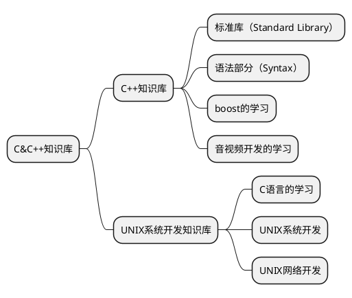

# note

## 1. note的简介

1. 每个知识库都有对应的代码仓库
2. 笔记是自己想法和思路的记录整理

## 2. 代码仓库

1. [C&C++知识库/C++知识库/标准库（Standard Library）](https://github.com/ZhanghHaoDev/std_stu)
2. [C&C++知识库/boost的学习](https://github.com/ZhanghHaoDev/boost_stu)
3. [C&C++知识库/音视频开发的学习](https://github.com/ZhanghHaoDev/av_dev_study.git)
4. [C&C++知识库/UNIX系统开发知识库/第五章 UNIX下的工具链的学习](https://github.com/ZhanghHaoDev/cmake)
5. [UNIX系统开发知识库](https://github.com/ZhanghHaoDev/unix_stu.git)

## 3. todo

1. 先搞定C/C++网络这块的内容：包括boost当中网络，UNIX网络开发
2. 整理UNIX系统开发知识库，首先整理知识框架，包括系统开发和网络开发应该合并到一起

## 4. 知识体系

