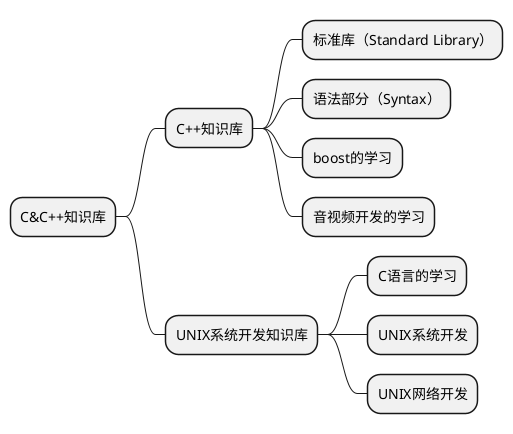

# note

## 1. note的简介

1. 知识库是第一层的目录
2. 笔记是自己随手记录的内容，会归纳到知识库中
3. 每个知识库都有对应的代码仓库

## 2. 代码仓库

1. [C&C++知识库/C++知识库/标准库（Standard Library）](https://github.com/ZhanghHaoDev/std_stu)
2. [C&C++知识库/boost的学习](https://github.com/ZhanghHaoDev/boost_stu)
3. [C&C++知识库/音视频开发的学习]()
4. [C&C++知识库/UNIX系统开发知识库/第五章 UNIX下的工具链的学习](https://github.com/ZhanghHaoDev/cmake)

## 3. todo

1. sdl2代码仓库和ffmpeg仓库的合并，合并为音视频开发的学习
2. unix仓库的建立
3. 先搞定C/C++网络这块的内容：包括boost当中网络，UNIX网络开发
4. 整理UNIX系统开发知识库，首先整理知识框架，包括系统开发和网络开发应该合并到一起

## 4. 知识体系

