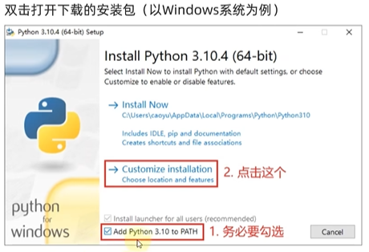
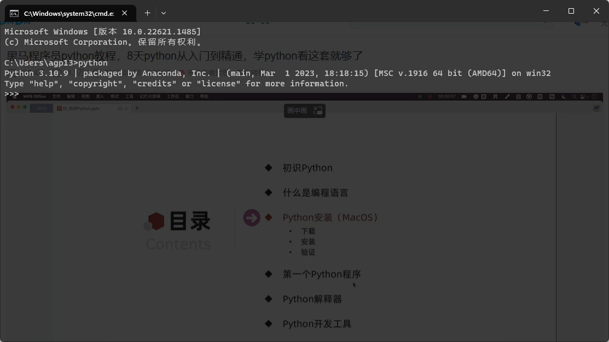
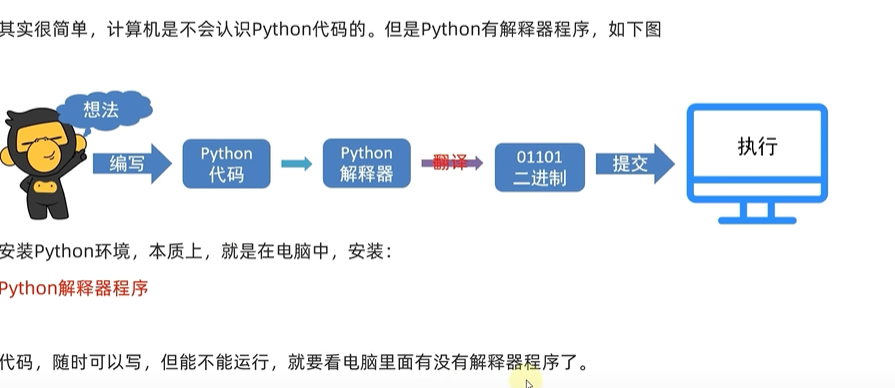

# 第一章 python简介

# 1. python安装

1. 下载

官网：

[https://www.python.org/](https://www.python.org/)

1. 验证：打开电脑cmd，输入python，如果出现下面的截图，就说明python安装好了

---

# 2. 第一个python程序

输出 hello word

---

【注意】：输入的程序代码都必须是英文的

# 3. python解释器

计算机只认识0和1 ，二进制代码

---

python解释器，是一个计算机程序，用来翻译python程序，并提交给计算机执行

所以，他的功能很简单，就两点：

1. 翻译代码
2. 提交给计算机执行

# 4. 安装pycharm

官网：

[https://www.jetbrains.com/pycharm/](https://www.jetbrains.com/pycharm/)

1. python常用的开发环境是：pycharm
2. pycharm需要以工程为单位，供我们使用，想要写代码需要先创建一个工程